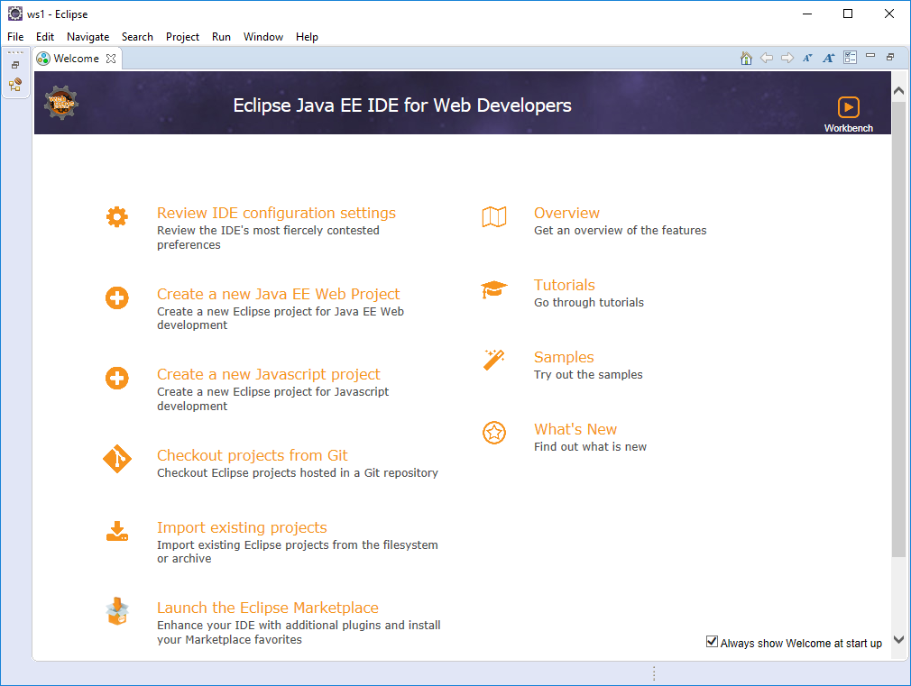
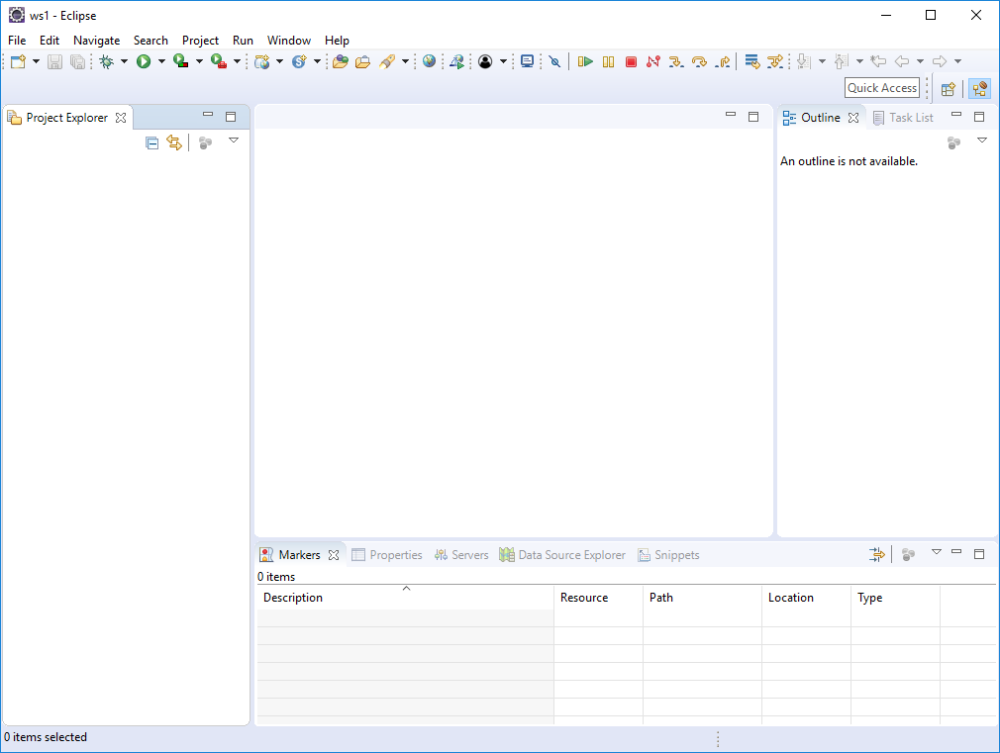

#Verify JDK

Open a Command Prompt in Window - or a terminal - on your workstation.

Enter the following command:

~~~
  java -version
~~~

this will verify that java is installed correctly, and will display the version number:

~~~
$ java -version
java version "1.8.0_60"
Java(TM) SE Runtime Environment (build 1.8.0_60-b27)
Java HotSpot(TM) 64-Bit Server VM (build 25.60-b23, mixed mode)
~~~

It might look slightly difference depending on your system. However, we are looking for 1.8.x version.

#Install Eclipse

Eclipse is a free, open source, Integrated Development Environment for Java. We will use it during the labs as the main environment for writing, testing and exploring Java programs.

Visit the Eclipse web site:

- <http://www.eclipse.org/downloads/eclipse-packages/>

Select the 'Eclipse for Java EE Developers' version.

On Windows, the install is merely a matter of extracting the arhive somethere, locating the Eclipse application binary, and launching it. On a Mac/Linux the installation may vary slightly.

Once installed and launched, it should look like this:

#Verify Eclipse

We will create a very simple "Hello World" application to test the installation. Eclipse is currently displaying what is called the "Welcome" screen. We can remove this and reveal the standard workbench by pressing the "close" button on the welcome screen:

This reveal the standard Eclipse "Java Perspective":

