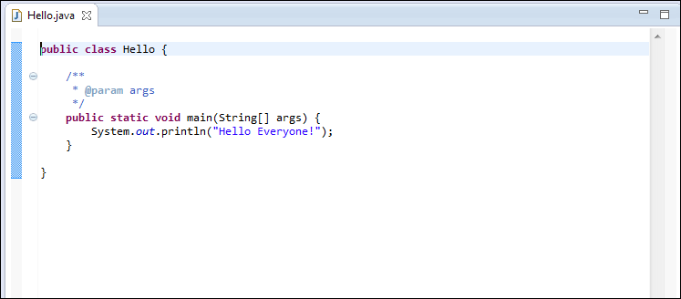
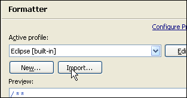
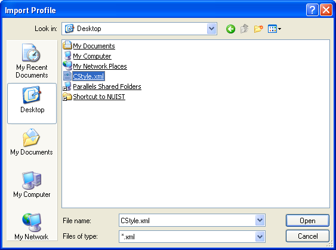
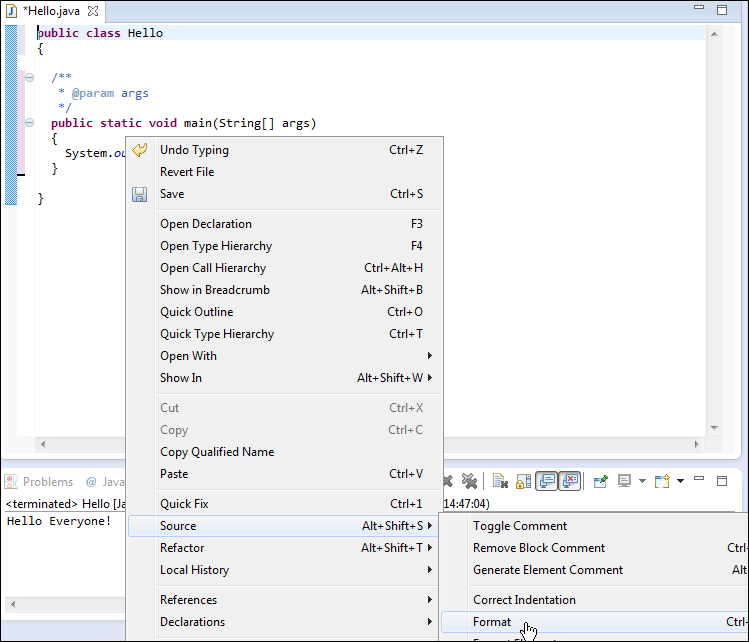

#HelloWorld

We will now create our first Java Application. We do this by first creating a Java project, selecting File->New->Other.

In the dialog, select 'Java->Java Project'

Call the project HelloJava:

... and press Finish:

This has created a project called HelloJava - we can explore this project in the "Package Explorer" window:

Currently the project is empty. We can add a new class to the project as follows:
Select the src node in the HelloJava project and right click (to bring up the context menu):

Select Class, which will bring up the New Java Class dialog::

Call the class Hello as shown above. Also, make sure to select the public static void main check box is checked:

Press finish - and the class hello.java will be generated:

Inside the opening and closing braces of the main() method, enter the following:

~~~java
      System.out.println("Hello Everyone!");
~~~

So that the full class looks like this:

We can now proceed to execute the program. We should expect it to print the message indicated on the console.

To execute, right click on Hello.java in the Package Explorer:

Select Run As->Java Application as shown above. The application will execute. The output is visible in the Console view along the end of the perspective:

We will make one small configuration change to Eclipse. In this course we choose to layout our source code a little differently to the default. We use a C Style formatting, instead of the built in Sun style.

This style is already prepared for you and you can download it 

- [cstyle.xml](../book/archives/cstyle.xml) 

Save this file somewhere on your computer (right click and select Save as...). In Eclipse, select Window->Preferences .In the Preferences dialog select Java->Code Style->Formatter...

Press the import button:

Navigate to and select the CStyle.xml file we saved above:

Press Apply and Ok...

This has introduced a revised source code formatter into our program. We can trigger this at any time by selecting Source->Format

This will have produced a very subtle change to the layout:

We can further tidy up the source by manually removing the comments (for the moment):

Finally, note that eclipse is a folding editor. This means we can remove from view selected elements if we wish to have an uncluttered high level view of the source. Hover the cursor over the main method:

... the press the mouse once, and the method will fold:

Pressing it again will expand ....

