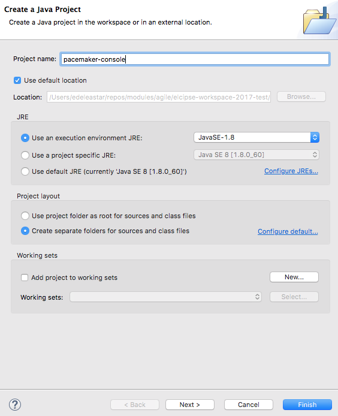
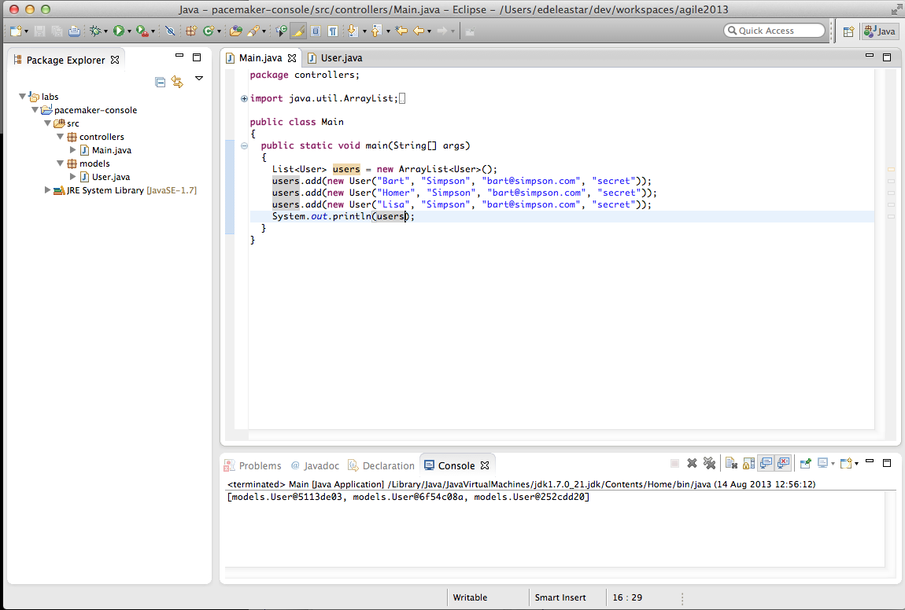

#Data Structure

Create a new project called `pacemaker-console'. Do this by selecting 'File->New->Project',  select "Java Project". Fill out the "New Java Project" wizard as shown:

Press "Finish".  In the new project, select 'src', right click and select 'new->package'. Call the package 'models' and press finish:

Selecting "models", select "File->New" and select "Class". Name the class "User":

Edit the User.java source - and replace the current contents with the following:

~~~
package models;

public class User 
{
  public String firstName;
  public String lastName;
  public String email;
  public String password;
  
  public User()
  {
  }
  
  public User(String firstName, String lastName, String email, String password)
  {
    this.firstName = firstName;
    this.lastName = lastName;
    this.email = email;
    this.password = password;
  }
}
~~~

In a new package called 'controllers', create a class called "Main" (follow same steps used to create User class above). Replace the contents of Main.java with the following

~~~
package controllers;

import java.util.ArrayList;
import java.util.List;

import models.User;

public class Main
{
  public static void main(String[] args)
  {
    List<User> users = new ArrayList<User>();
    users.add(new User("Bart", "Simpson", "bart@simpson.com", "secret"));
    users.add(new User("Homer", "Simpson", "bart@simpson.com", "secret"));
    users.add(new User("Lisa", "Simpson", "bart@simpson.com", "secret"));
    System.out.println(users);
  }
}

~~~

The workbench should now look as follows (ignore the 'labs' node in package view for the moment):

Launch the application as follows. Do this by selecting "Main.java" in the Package Explorer and select "Run->Run As->Java Application". This executes the application (running main) which in turn prints output to the console.

