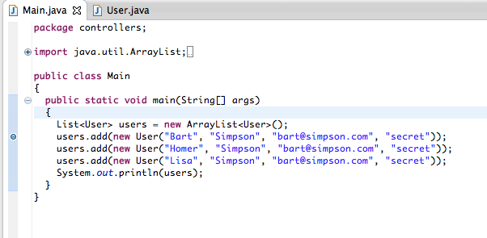
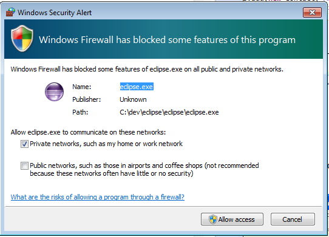
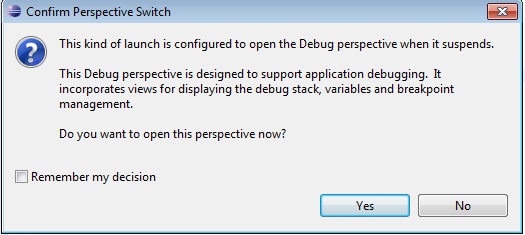
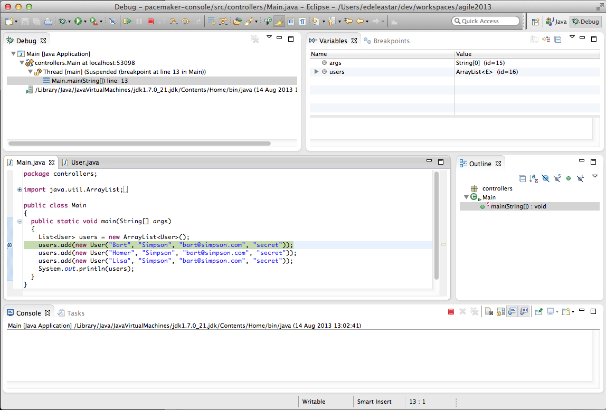
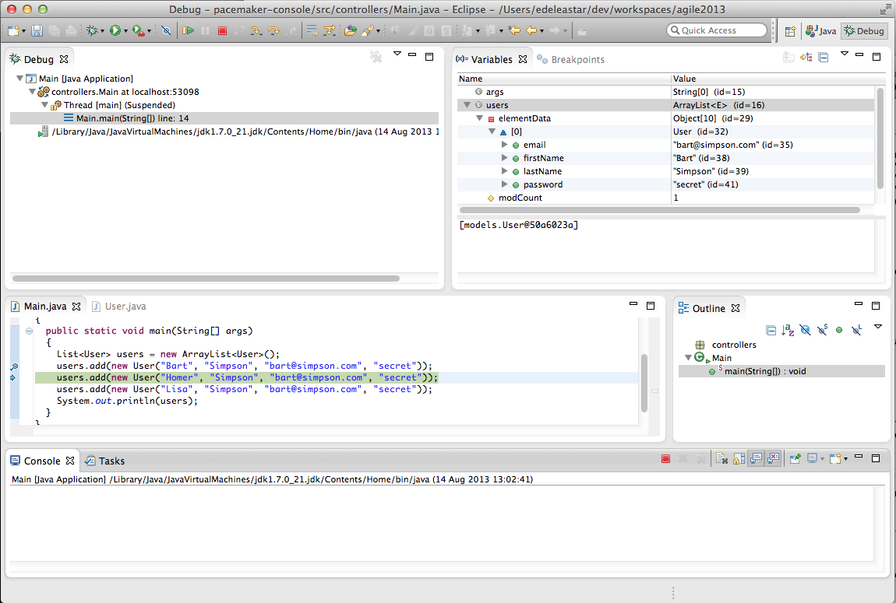
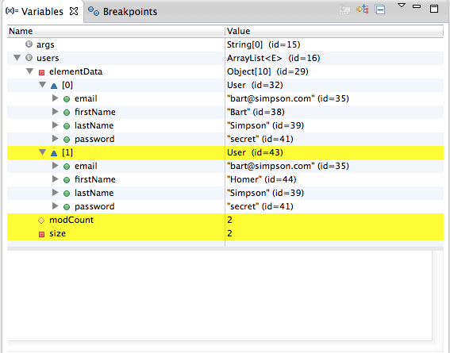
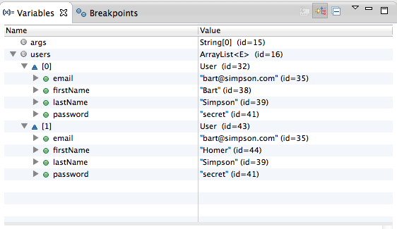

# Debug

Now explore the "users" data structure in the debugger: Editing the Main.java source file, double click inside the scroll bar on first line of the main method:

This creates a breakpoint (visually a small blue bubble). Run the program again: - this time under the debugger. Quickest way to do this is to press the "Debug last launched" button.

You may see the permissions dialog again:

and also a switch perspective dialog:

Finally, the workspace will be reconfigured as follows:

Selecting 'Run->Step Over" from the eclipse menu several times will execute each line of the main method.

Note the editor view shows each line under execution. The Variables view shows the contacts data structure being populated.

Exploring the variable window should enable you to inspect each contact object as it is inserted. This variable window can also show a "Logical View" of the data structure (press the second button in the toolbar)

To terminate the application, press the button in the Console view:

... and the restore the Java "Perspective":

If you are not familiar with debugging in eclipse, spend some time repeating the above steps. In particular, hover over the various tool bar buttons visible in the debug perspective to get an general understanding of how to control and explore a running application.