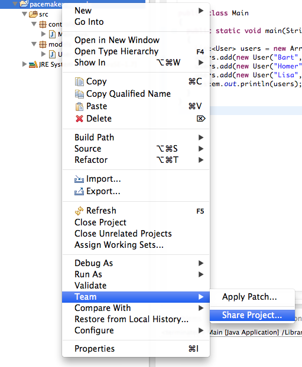
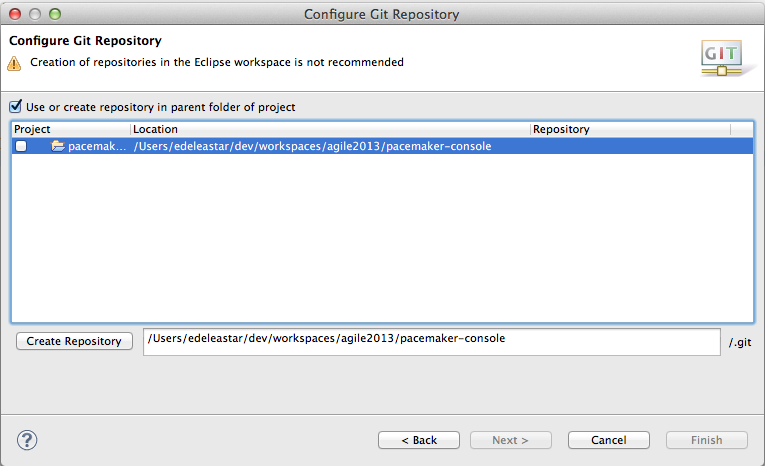
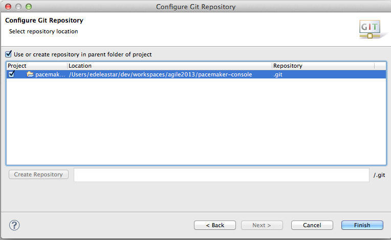

# Git Version Control

Before moving on to the next step - we will commit this project to 'git' version control.

First, right click on the project and select 'Team->Share Project'

and then you will see this:

Tick the 'Use or create repository', and then press the 'Create Repository' button:

Noting particularly noticable will change -

But you can now press finish.

You may notice that your ecipse project icons look a little different.

Now, select the project again in Package Explorer, select 'Team' - and this time the menu will be different:

Select 'Commit' - and enter details as shown here:

Select all the 'unstaged' files 

... and select 'add to index' from the context menu:

Press "Commit" - which will clear the staging panel:

Aslo, now the icons will change again in the package explorer:

Although we haven't saved this to any external server, we have preserved the applications current structure.

You may be more familiar with the git command line or another git visual client.

