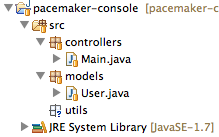
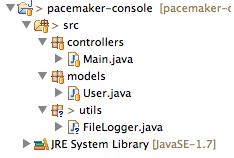
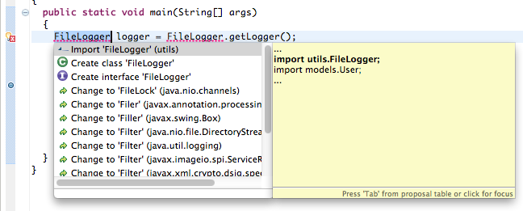
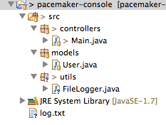
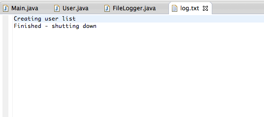
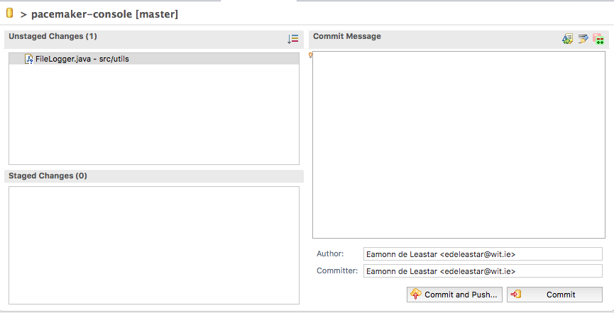
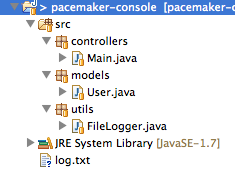

#Pattern

Create a new package in the eclipse project, called 'utils'

Introduce the following class into that package:

~~~
package utils;

import java.io.FileNotFoundException;
import java.io.FileWriter;
import java.io.IOException;
import java.io.PrintWriter;

public class FileLogger
{
  private static FileLogger logger;

  private FileLogger()
  {
  }

  public static FileLogger getLogger()
  {
    if (logger == null)
    {
      logger = new FileLogger();
    }
    return logger;
  }

  public boolean log(String msg)
  {
    try
    {
      PrintWriter writer = new PrintWriter(new FileWriter("log.txt", true));
      writer.println(msg);
      writer.close();
    }
    catch (FileNotFoundException ex)
    {
      return (false);
    }
    catch (IOException ex)
    {
      return (false);
    }
    return (true);
  }
}
~~~

Project workspace should be structured as follows:

Edit the Main.java, replacing the main method with the following:

~~~
  public static void main(String[] args)
  {
    FileLogger logger = FileLogger.getLogger();
    logger.log("Creating user list");
    
    List<User> users = new ArrayList<User>();
    users.add(new User("Bart", "Simpson", "bart@simpson.com", "secret"));
    users.add(new User("Homer", "Simpson", "bart@simpson.com", "secret"));
    users.add(new User("Lisa", "Simpson", "bart@simpson.com", "secret"));
    System.out.println(users);
    
    logger.log("Finished - shutting down");
  }
~~~

Note that there will be one error - the FileLogger class is being used in the Main.without being imported. Selecting the error in the editor will pop-up some autocorrect suggestions:

If you select the one shown then the appropriate import will be inserted into the class:

~~~
import utils.FileLogger;
~~~

Execute the program. Do this be selecting main.java in the package explorer, and selecting menu "Run->Run As->Java Application" as before.

The console should list data structure as before, and a log file "log.txt" should be generated. As the file is just generated, it will not be visible in the workspace. To view it, select the 'pacemaker-console' project in the package explorer, and select "File->Refresh". Package explorer will be updated to reflect the new file generated in the workspace:

Double click log.txt to view the log:

Before we finish this step, we can 'commit' changes we have just made. In Package Explorer, select the project, right click and select 'Team->Commit'.

Fill out as shown above (note: we do not commit the log file itself it is visible) - add the new source file to the index and commit.

Notice the changes in the package explorer icons:

