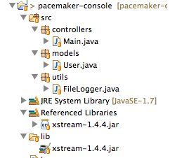

#Setup

You should have a project from lab01 looking something like this:

This is an archive of the project if you dont have it completed:

- <https://github.com/wit-computing-msc-2017/pacemaker-console/releases/tag/lab01>

Make sure you can import the application into eclipse and run it