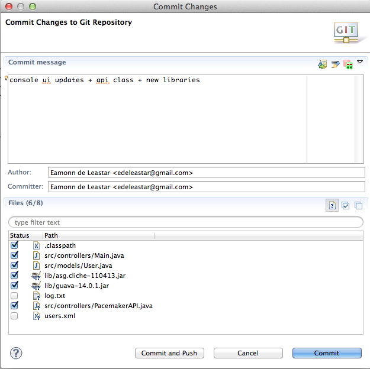

#toString

The command line app is a little underwhelming - particular the display of the User objects, which appear as some sort of memory address.

We can fix this my introducing a 'toString' method into the User class:

~~~java
  public String toString()
  {
    return firstName + ' ' + lastName +' ' +  email +' ' +  password; 
  }
~~~

Run the app again, and verify that you can see the actual user details.

One of the libraries we imported:

- <https://code.google.com/p/guava-libraries/>

contains some useful utilities for building toString. Introduce the following import into the top of the User class:

~~~
import static com.google.common.base.MoreObjects.toStringHelper;
~~~

and rewrite toString as follows:

~~~java
  public String toString()
  {
    return toStringHelper(this).addValue(firstName)
                               .addValue(lastName)
                               .addValue(password)
                               .addValue(email)                               
                               .toString();
  }
~~~

Run the app again, and note the slightly changed representation of the Users.

We should commit this version now before making any more changes. Right click on the project in Package Explore, select Team->Commit - and fill out the form something like this:

The project might look something like this now:

See if you can figure out the meaning of the different decorations on the files.
