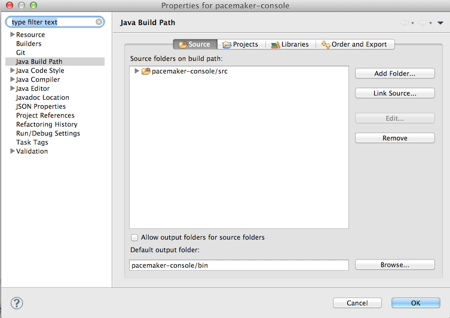
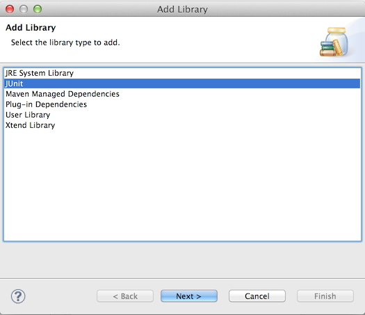
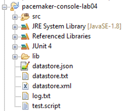
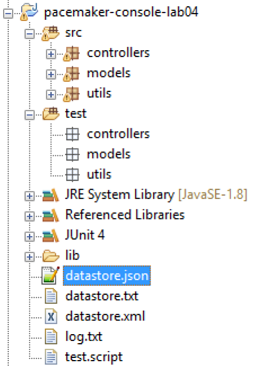

#Junit 4

We will introduce unit testing infrastructure + unit tests to exercise the features of the app developed so far.

First, locate the project properties (context menu->Build Path->Configure Build Path):

Select Libraries -> Add Library:

And select JUnit - make sure it is JUnit 4. The dependency should be clear from the project workspace:

Now create a new 'source' folder in the project called 'test'. Once created, replicate the package structure in this folder. You workspace should look like this:

The new packages are empty for the moment.

