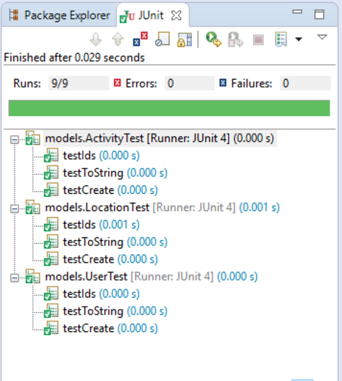

#UserTest & ActivityTest

Include this test:

~~~java
package models;

import static org.junit.Assert.*;

import java.util.HashSet;
import java.util.Set;

import org.junit.Test;

public class UserTest
{
  private User[] users =
  {
    new User ("marge", "simpson", "marge@simpson.com",  "secret"),
    new User ("lisa",  "simpson", "lisa@simpson.com",   "secret"),
    new User ("bart",  "simpson", "bart@simpson.com",   "secret"),
    new User ("maggie","simpson", "maggie@simpson.com", "secret")
  };
  User homer = new User ("homer", "simpson", "homer@simpson.com",  "secret");
  
  @Test
  public void testCreate()
  {
    assertEquals ("homer",               homer.firstName);
    assertEquals ("simpson",             homer.lastName);
    assertEquals ("homer@simpson.com",   homer.email);   
    assertEquals ("secret",              homer.password);   
  }
  
  @Test
  public void testIds()
  {
    Set<Long> ids = new HashSet<>();
    for (User user : users)
    {
      ids.add(user.id);
    }
    assertEquals (users.length, ids.size());
  }
  
  @Test
  public void testToString()
  {
    assertEquals ("User{" + homer.id + ", homer, simpson, secret, homer@simpson.com, {}}", homer.toString());
  }
}
~~~

Make sure it passes. Note carefully the `testIds()` test. Can you see its rationale?

Here is an ActivityTest:

~~~java
package models;

import static org.junit.Assert.*;

import java.util.HashSet;
import java.util.Set;

import org.junit.Test;

public class ActivityTest
{
  private Activity[] activities =
  {
    new Activity ("walk",  "fridge", 0.001),
    new Activity ("walk",  "bar",    1.0),
    new Activity ("run",   "work",   2.2),
    new Activity ("walk",  "shop",   2.5),
    new Activity ("cycle", "school", 4.5)
  };

  Activity test = new Activity ("walk",  "fridge", 0.001);

  @Test
  public void testCreate()
  {
    assertEquals ("walk",          test.type);
    assertEquals ("fridge",        test.location);
    assertEquals (0.0001, 0.001,   test.distance);    
  }

  @Test
  public void testIds()
  {
    Set<Long> ids = new HashSet<>();
    for (Activity activity : activities)
    {
      ids.add(activity.id);
    }
    assertEquals (activities.length, ids.size());
  }
  
  @Test
  public void testToString()
  {
    assertEquals ("Activity{" + test.id + ", walk, fridge, 0.001, []}", test.toString());
  }
}
~~~

All these tests should pass, and should be able to run all test in one test runner:

