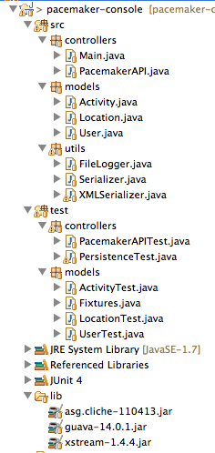

#Test Packages

The test classes should align with the packages they are testing. If your project does not resemble the layout below, refactor it:

It should be possible to do this just using drag and drop within the package explorer.
