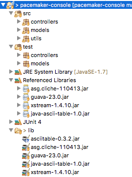

# Git & Maven

In last weeks lab we referred to some useful utilities libraries for rendering tabular data:

- <https://github.com/robinhowlett/java-ascii-table>

In order to use this library, you will need to do two things:

1. Clone the repository onto your workstation
2. Rebuild the project, and include the jar file into your project.

For 1, you will need to have git installed, and then execute the following command:

~~~
git clone https://github.com/robinhowlett/java-ascii-table.git
~~~

This will replicate the project locally.

For 2, you must first install maven:

- <https://maven.apache.org>

Make sure to follow the installation instructions for your platform. If installed correctly, the the following command should work correctly;

~~~
$ mvn -version
~~~

This should return something like this:

~~~
Apache Maven 3.5.0 (ff8f5e7444045639af65f6095c62210b5713f426; 2017-04-03T20:39:06+01:00)
Maven home: /Users/edeleastar/dev/apache-maven-3.5.0
Java version: 1.8.0_60, vendor: Oracle Corporation
Java home: /Library/Java/JavaVirtualMachines/jdk1.8.0_60.jdk/Contents/Home/jre
Default locale: en_IE, platform encoding: UTF-8
OS name: "mac os x", version: "10.13", arch: "x86_64", family: "mac"
~~~

Next weeks topic includes an in depth review of Maven, so installing the package now is a useful preparation.

Once installed, we can enter this command from inside the folder containing the project you cloned:

~~~
$ mvn package
~~~

This may take a few minutes to download and build all downstream components. It should finish successfully with something like this:

~~~
canning for projects...
[INFO]
[INFO] ------------------------------------------------------------------------
[INFO] Building java-ascii-table 1.0
[INFO] ------------------------------------------------------------------------
[INFO]
[INFO] --- maven-resources-plugin:2.6:resources (default-resources) @ java-ascii-table ---
[INFO] Using 'UTF-8' encoding to copy filtered resources.
[INFO] skip non existing resourceDirectory /Users/edeleastar/repos/modules/agile/labs/java-ascii-table/src/main/resources
[INFO]
[INFO] --- maven-compiler-plugin:3.2:compile (default-compile) @ java-ascii-table ---
[INFO] Nothing to compile - all classes are up to date
[INFO]
[INFO] --- maven-resources-plugin:2.6:testResources (default-testResources) @ java-ascii-table ---
[INFO] Using 'UTF-8' encoding to copy filtered resources.
[INFO] skip non existing resourceDirectory /Users/edeleastar/repos/modules/agile/labs/java-ascii-table/src/test/resources
[INFO]
[INFO] --- maven-compiler-plugin:3.2:testCompile (default-testCompile) @ java-ascii-table ---
[INFO] No sources to compile
[INFO]
[INFO] --- maven-surefire-plugin:2.12.4:test (default-test) @ java-ascii-table ---
[INFO] No tests to run.
[INFO]
[INFO] --- maven-jar-plugin:2.4:jar (default-jar) @ java-ascii-table ---
[INFO] ------------------------------------------------------------------------
[INFO] BUILD SUCCESS
[INFO] ------------------------------------------------------------------------
[INFO] Total time: 1.077 s
[INFO] Finished at: 2017-10-07T08:28:05+01:00
[INFO] Final Memory: 12M/309M
[INFO] ------------------------------------------------------------------------
~~~

It will have generated a jar file called `java-ascii-table-1.0.jar` into the `./target` subfolder in the project. Copy this file intro your `pacemaker/lib` folder, and add the jar to your build path.

The project should look like this in Eclipse:

If you are having trouble with maven - here is a version of the jar file you can use without completing the above steps:

- [java-ascii-table-1.0.jar](archives/java-ascii-table-1.0.jar)

