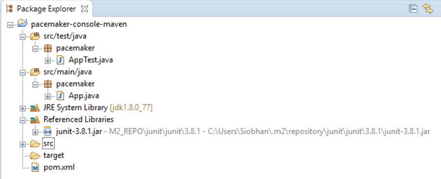

#Pacemaker with Maven Project

##Review pacemaker project

You should have the pacemaker project from lab05 in your workspace.  If you don't have a lab05 pacemaker project, you can download it from here:  

- <https://github.com/wit-computing-msc-2017/pacemaker-console/releases/tag/lab05>

We will now convert this to a Maven-based project and use the Maven Build System to manage our dependencies (i.e. components, JUnit versions, etc).

##Create a starter Maven Project

Navigate to a suitable folder (i.e. your eclipse workspace that you plan to use for maven projects) and enter the following command to create a starter maven project called **pacemaker-console-maven**:

~~~
 mvn archetype:generate -DarchetypeGroupId=org.apache.maven.archetypes -DarchetypeArtifactId=maven-archetype-quickstart -DgroupId=pacemaker -DartifactId=pacemaker-console-maven
~~~

If you are asked to enter versions for certain items, just hit the enter key.  Eventually it should complete successfully.

The command will have created the following project structure:

The key file to inspect is the generated pom.xml:

~~~xml
<project xmlns="http://maven.apache.org/POM/4.0.0" xmlns:xsi="http://www.w3.org/2001/XMLSchema-instance"
  xsi:schemaLocation="http://maven.apache.org/POM/4.0.0 http://maven.apache.org/xsd/maven-4.0.0.xsd">
  <modelVersion>4.0.0</modelVersion>

  <groupId>pacemaker</groupId>
  <artifactId>pacemaker-console-maven</artifactId>
  <version>1.0-SNAPSHOT</version>
  <packaging>jar</packaging>

  <name>pacemaker-console-maven</name>
  <url>http://maven.apache.org</url>

  <properties>
    <project.build.sourceEncoding>UTF-8</project.build.sourceEncoding>
  </properties>

  <dependencies>
    <dependency>
      <groupId>junit</groupId>
      <artifactId>junit</artifactId>
      <version>3.8.1</version>
      <scope>test</scope>
    </dependency>
  </dependencies>
</project>
~~~

 

##Open your project in Eclipse

Open Eclipse.  On the menu bar, choose **File**, then **Import...**.

When the dialog opens, select **Maven**, then **Existing Maven Projects**.  Locate your  
**pacemaker-console-maven** project and import it.  

If you are using an older version of Eclipse, you **may** need to perform these steps **instead** of the above import.

- On the command line, change into the pacemaker-console-maven folder and enter the following command:

~~~
mvn eclipse:eclipse
~~~

- This will generate an eclipse project from the pom.

- In eclipse, import this project (as an existing project). It should show up on your workspace like this:

##Copy paste sources into new project

Within eclipse, you should be able to copy/paste all of the sources (the .java files only) into the appropriate folder in the new project. Also, delete the maven generated **pacemaker** packages:

There are a significant number of errors however, which we will fix in the next step.  These errors have arisen because we haven't yet included our components (e.g. XStream, Cliche, etc) in the project. We are going to get Maven to manage this for us!

