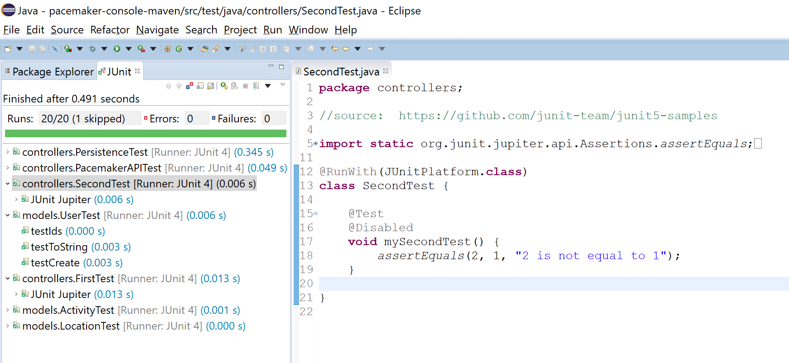

#Maven and JUnit5

Eclipse Oxygen.1a (4.7.1a) comes with JUnit5 support:

- <https://marketplace.eclipse.org/content/junit-5-support-oxygen>

However, as an additional Maven exercise, we will install it via Maven for our pacemaker project.  

Note: that it is **infinitely** easier to use the JUnit5 support directly in Eclipse...this approach is just to show you another aspect of Maven (build and properties)!  For future projects, you can simply add JUnit5 to your build path (Java build path --> Libraries --> Add Library --> JUnit --> JUnit 5).

##JUnit Maven Surefire plugin

The JUnit team has developed a very basic provider for Maven Surefire that lets you run JUnit 4 and JUnit5 (Jupiter) tests via **mvn test**.

Briefly review the **junit5-maven-consumer** project:

- <https://github.com/junit-team/junit5-samples>

We will now incorporate FirstTest.java and SecondTest.java into our pacemaker-console-maven project.  Once we are satisfied that our JUnit5 tests are running correctly via maven, we will then update some of our existing pacemaker JUnit4 tests to JUnit5.

##Incorporating JUnit5 capabilities in pom.xml

Edit the pom.xml file in your **pacemaker-console-maven** project to include the following.  Note if you have a **<build>** element in your pom already, just add this plugin to it:

~~~XML
   <build>
 		<!-- included for JUnit 5 -->
        <plugins>
            <plugin>
                <artifactId>maven-compiler-plugin</artifactId>
                <version>3.1</version>
                <configuration>
                    <source>1.8</source>
                    <target>1.8</target>
                </configuration>
            </plugin>
        </plugins>
    </build>
~~~

In pom.xml, edit the properties tag to include the following three JUnit5 properties:

~~~xml
	<properties>
		<project.build.sourceEncoding>UTF-8</project.build.sourceEncoding>
		<maven.compiler.source>1.8</maven.compiler.source>
		<maven.compiler.target>1.8</maven.compiler.target>
		<!-- included for JUnit 5 -->
		<junit.jupiter.version>5.0.0</junit.jupiter.version>
        <junit.platform.version>1.0.0</junit.platform.version>
        <junit.platform.version>1.0.0</junit.platform.version>
	</properties>
~~~

Finally, edit the pom.xml to include the following three dependencies:

~~~xml
		<!-- included for JUnit 5 (3 dependencies) -->		
		<dependency>
            <groupId>org.junit.jupiter</groupId>
            <artifactId>junit-jupiter-engine</artifactId>
            <version>${junit.jupiter.version}</version>
        </dependency>
        <dependency>
            <groupId>org.junit.jupiter</groupId>
            <artifactId>junit-jupiter-api</artifactId>
            <version>${junit.jupiter.version}</version>
            <scope>test</scope>
        </dependency>
        <dependency>
            <groupId>org.junit.platform</groupId>
            <artifactId>junit-platform-runner</artifactId>
            <version>${junit.platform.version}</version>
            <scope>test</scope>
        </dependency>
~~~

Save pom.xml and run the command, **mvn validate** to ensure that your pom.xml is ok. 

##Writing your first JUnit5 tests

In the test/controllers package, we can test the JUnit5 dependency by creating this class: 

~~~java
package controllers;

//source:  https://github.com/junit-team/junit5-samples

import static org.junit.jupiter.api.Assertions.assertEquals;
import org.junit.jupiter.api.DisplayName;
import org.junit.jupiter.api.Test;
import org.junit.jupiter.api.TestInfo;
import org.junit.platform.runner.JUnitPlatform;
import org.junit.runner.RunWith;

@RunWith(JUnitPlatform.class) 
class FirstTest {

	@Test
	@DisplayName("My 1st JUnit 5 test!")
	void myFirstTest(TestInfo testInfo) {
		assertEquals(2, 1 + 1, "1 + 1 should equal 2");
		assertEquals("My 1st JUnit 5 test!", testInfo.getDisplayName(), () -> "TestInfo is injected correctly");
	}

}
~~~

Run **mvn test**. The output should show that **FirstTest** JUnit5 tests ran successfully.

~~~
-------------------------------------------------------
 T E S T S
-------------------------------------------------------
Running controllers.FirstTest
Tests run: 1, Failures: 0, Errors: 0, Skipped: 0, Time elapsed: 0.051 sec - in controllers.FirstTest
Running controllers.PacemakerAPITest
Tests run: 7, Failures: 0, Errors: 0, Skipped: 0, Time elapsed: 0.081 sec - in controllers.PacemakerAPITest
Running controllers.PersistenceTest
Security framework of XStream not initialized, XStream is probably vulnerable.
Tests run: 2, Failures: 0, Errors: 0, Skipped: 0, Time elapsed: 0.346 sec - in controllers.PersistenceTest
Running models.ActivityTest
Tests run: 3, Failures: 0, Errors: 0, Skipped: 0, Time elapsed: 0.002 sec - in models.ActivityTest
Running models.LocationTest
Tests run: 3, Failures: 0, Errors: 0, Skipped: 0, Time elapsed: 0.001 sec - in models.LocationTest
Running models.UserTest
Tests run: 3, Failures: 0, Errors: 0, Skipped: 0, Time elapsed: 0.001 sec - in models.UserTest

Results :

Tests run: 19, Failures: 0, Errors: 0, Skipped: 0

[INFO] ------------------------------------------------------------------------
[INFO] BUILD SUCCESS
[INFO] ------------------------------------------------------------------------
[INFO] Total time: 5.529 s
[INFO] Finished at: 2017-10-11T15:41:11+01:00
[INFO] Final Memory: 17M/188M
[INFO] ------------------------------------------------------------------------
~~~

##Adding a second test class

Now that JUnit5 is recognised by your app, create another test class in the test/controllers package:

~~~java
package controllers;

//source:  https://github.com/junit-team/junit5-samples

import static org.junit.jupiter.api.Assertions.assertEquals;
import org.junit.jupiter.api.Disabled;
import org.junit.jupiter.api.Test;
import org.junit.platform.runner.JUnitPlatform;
import org.junit.runner.RunWith;

@RunWith(JUnitPlatform.class) 
class SecondTest {

	@Test
	@Disabled
	void mySecondTest() {
		assertEquals(2, 1, "2 is not equal to 1");
	}
	
}
~~~

Save it and re-run **mvn test** again.  Your output should now show that you ran 20 tests with one skipped:

~~~
Tests run: 20, Failures: 0, Errors: 0, Skipped: 1

[INFO] ------------------------------------------------------------------------
[INFO] BUILD SUCCESS
[INFO] ------------------------------------------------------------------------
[INFO] Total time: 4.883 s
[INFO] Finished at: 2017-10-11T15:43:58+01:00
[INFO] Final Memory: 16M/183M
[INFO] ------------------------------------------------------------------------
~~~

If required, use the command **mvn eclipse:eclipse** to refresh eclipse.  

##Running JUnit5 inside Eclipse

Now that we have JUnit5 running form the Maven console, we will now focus on running JUnit5 through Eclipse.  

When you right click on any JUnit5 test class e.g. FirstTests.java and select the **Run as** option, you will now be presented with an option to run it as a JUnit Test.  

If we ran the entire suite of tests that we have (note they are a mix of JUnit 4 and JUnit 5), we should now get this output:

Note that the JUnit output from a JUnit5 test is different to that of a JUnit4.  In JUnit 4, the test methods are all listed below.  But in the JUnit 5 test, when all tests are successful, the test runner is listed instead, regardless of the number of test methods in the class.  

Experiment with JUnit5 by adding extra methods to your JUnit5 class and also force a fail on one of these extra methods.  This will get you used to the JUnit5 functionality in Eclipse. I've provided a sample of this experimentation appraoch here:

