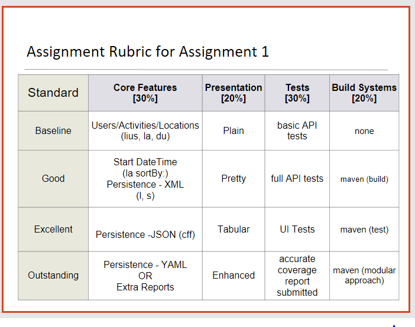

#Exercises

The complete maven project so far:

- [pacemaker-console-maven.zip](archives/pacemaker-console-maven.zip)

##Exercise 1

The purpose of the JUnit5 step was to incorporate JUnit5 capabilities into both the maven build of **pacemaker-console-maven** and the Eclipse IDE, whilst verifying that the JUnit5 tests were running correctly.  

You are now in a position to refactor any of your pacemaker tests from JUnit4 to JUnit5, should you wish to do so.  

Note: you can delete the FirstTest and SecondTest classes as they were only for verification purposes.

##Exercise 2

*In this exercise, we will experiment with the submlime editor and make our code changes in it, as opposed to using Eclipse. We will then use the Maven console to compile, test and run these changes.*

Install the following editor:

- <http://www.sublimetext.com/>

Note that by just dragging / dropping a folder into the editor window a 'project' view is presented, not unlike the package view in Eclipse. This includes syntax highlighting, but not of course refactoring or debugging.

Make a superficial change to the user interface of the pacemaker application - a different greeting for example. Just using maven - and the execution scripts we have covered in the previous steps, build, test and interactively execute the application.

##Exercise 3

In the Presentation column of our Assignment 1 marking rubric, you will notice the Outstanding grade references **Enhanced** presentation.  

Here, one option could be to use coloured console output.  This is a good discussion on applicable components that could be used:

- <https://stackoverflow.com/questions/435740/are-there-good-java-libraries-that-facilitate-building-command-line-applications>

Note that the top recommended library is:

- <https://github.com/jline/jline3>

A demo of the JLine3 CLI in use is here:

- <https://github.com/jline/jline3/wiki/Demos>

And an example of JLine3 code:

- <https://github.com/jline/jline3/blob/master/builtins/src/test/java/org/jline/example/Example.java>

If you are planning on adding such a component to your assignment, use Maven to incorporate the appropriate dependency references into the pom file and experiment with the functionality.

- <http://mvnrepository.com/>

Remember, the steps involved in bringing in a new library:

- incorporate the dependency into the pom
- do a build or test (via maven) 
- regenerate the eclipse project using 'mvn eclipse:eclipse'
- refresh the project in eclipse

