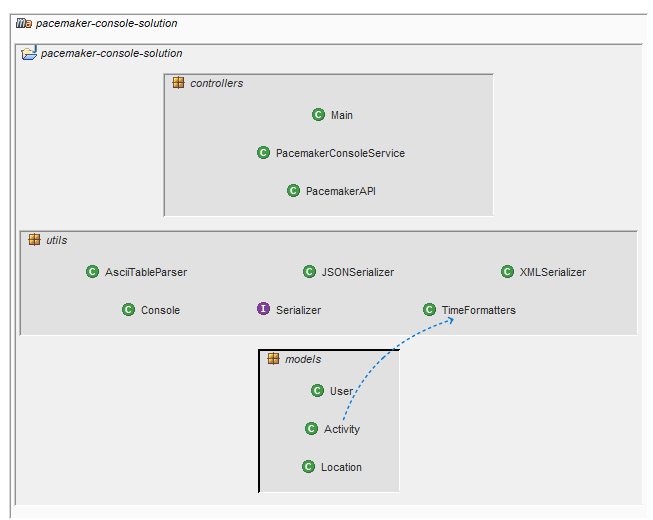
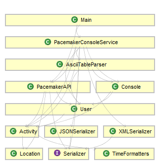
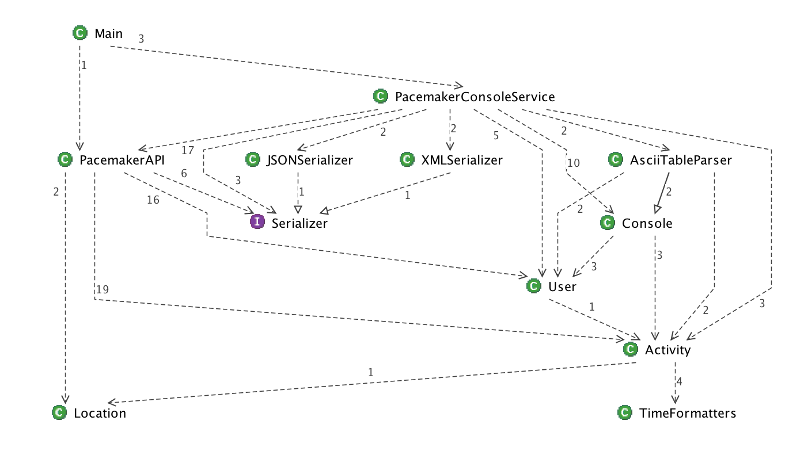

# Architecture

To get an overview of the proposed solution, have a look at the below architecture diagrams (produced using Structure101 software).

##Packages and their entities

The assignment solution has a number of source files and interdependencies between these files.

We use containers (packages) to manage complexity. Containment creates dependencies between containers.

##Dependencies

The dependencies in our assignment solution:

When dependencies all point in the same direction (e.g. downwards), the cumulative dependency is smallest.

Another view of our dependencies, with cardinalities representing the number of calls. This image should give you an appreciation of how the source files interact in our system.

##Classes/Interfaces and their responsibilities

####controllers:

- **Main**: Starts the app.  Creates a console shell attached to the PacemakerConsoleService.  Automatically saves the data created in the session upon exit.

- **PacemakerConsoleService**: defines the shell commands and invokes relevant Console command to render the data (coming from PacemakerAPI) on the console.

- **PacemakerAPI**: The pacemaker API that manages the user, activity and location data in the system (note: it is now independent of I/O approach).

####models:

- **User**: manages a single user and their associated activities

- **Activity**: manages a single activity and the routes (Location) associated with the activity.

- **Location**: manages a single location.

####utils:

- **Console**: A utility that acts as a base class for rendering users and activities onto the console.  Basic System.out.println is used in this base class.  Such as approach allows for future app evolutions to use other parsers.

- **AsciiTableParser**: A utility that extends the Console class and overrides the methods to render users and activities on the console using the ASCIITable utility.  Also provides an status (e.g ok, not found) when rendering data.

- **TimeFormatters**:  A utility that provides methods to parseDateTime and parseDuration.  These methods are used mainly in the Activity class.

- **Serializer**: an interface to provide a generic set of method signatures for serialization.

- **JSONSerializer**: manages the input and output (serialization) of JSON objects, adhering to the Serializer interface. 

- **XMLSerializer**: manages the input and output (serialization) of overrides the objects, adhering to the Serializer interface

