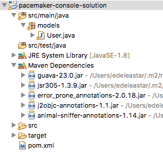
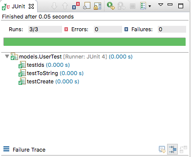

# User Model

In `src/main/java` source folder in Eclipse, create a new package called `models`. In this package create a new class called `User`:

## User

~~~
package models;

import static com.google.common.base.MoreObjects.toStringHelper;

import java.io.Serializable;
import java.util.HashMap;
import java.util.Map;
import java.util.UUID;

import com.google.common.base.Objects;

public class User implements Serializable {

  public String id;
  public String firstName;
  public String lastName;
  public String email;
  public String password;

  public User() {
  }

  public String getId() {
    return id;
  }

  public String getFirstname() {
    return firstName;
  }

  public String getLastname() {
    return lastName;
  }

  public String getEmail() {
    return email;
  }

  public User(String firstName, String lastName, String email, String password) {
    this.id = UUID.randomUUID().toString();
    this.firstName = firstName;
    this.lastName = lastName;
    this.email = email;
    this.password = password;
  }

  @Override
  public boolean equals(final Object obj) {
    if (obj instanceof User) {
      final User other = (User) obj;
      return Objects.equal(firstName, other.firstName)
          && Objects.equal(lastName, other.lastName)
          && Objects.equal(email, other.email)
          && Objects.equal(password, other.password);
    } else {
      return false;
    }
  }

  @Override
  public String toString() {
    return toStringHelper(this).addValue(id)
        .addValue(firstName)
        .addValue(lastName)
        .addValue(password)
        .addValue(email)
        .toString();
  }

  @Override
  public int hashCode() {
    return Objects.hashCode(this.id, this.lastName, this.firstName, this.email, this.password);
  }
}
~~~ 

This will have errors immediately - as we are relying on the `guava` library, currently not included in the dependencies. Insert the following in the the `<dependencies>` in the POM:

~~~
    <dependency>
      <groupId>com.google.guava</groupId>
      <artifactId>guava</artifactId>
      <version>23.0</version>
    </dependency>
~~~

Eclipse should trigger maven to download and include the library in the project, eliminating the errors. Notice that the Eclipse workspace will include a new `Maven Dependencies` entry:

The new dependencies include other libraries upstream of the guava library. These can also be seen from the Maven Central repository for guava:

- <https://mvnrepository.com/artifact/com.google.guava/guava/23.0>

## User Unit Test

In the `src/test/java` folder, create a `models` package. Bring in these 2 classes (if prompted to add JUnit to the build path, don't...we will add it via pom.xml):

## Fixtures

~~~
package models;

import java.util.ArrayList;
import java.util.Arrays;
import java.util.List;

public class Fixtures {

  public static List<User> users = new ArrayList<>(Arrays.asList(
      new User("marge", "simpson", "marge@simpson.com", "secret"),
      new User("lisa", "simpson", "lisa@simpson.com", "secret"),
      new User("bart", "simpson", "bart@simpson.com", "secret"),
      new User("maggie", "simpson", "maggie@simpson.com", "secret")));
}
~~~

## UserTest

~~~
package models;

import static org.junit.Assert.*;

import java.util.HashSet;
import java.util.Set;

import org.junit.Test;

import static models.Fixtures.users;

public class UserTest {

  User homer = new User("homer", "simpson", "homer@simpson.com", "secret");

  @Test
  public void testCreate() {
    assertEquals("homer", homer.firstName);
    assertEquals("simpson", homer.lastName);
    assertEquals("homer@simpson.com", homer.email);
    assertEquals("secret", homer.password);
  }

  @Test
  public void testIds() {
    Set<String> ids = new HashSet<>();
    for (User user : users) {
      ids.add(user.id);
    }
    assertEquals(users.size(), ids.size());
  }

  @Test
  public void testToString() {
    assertEquals("User{" + homer.id + ", homer, simpson, secret, homer@simpson.com}",
        homer.toString());
  }
}
~~~

The test will have syntax errors - again called by missing dependencies. Here is the JUnit library we are missing:

~~~
    <dependency>
      <groupId>junit</groupId>
      <artifactId>junit</artifactId>
      <version>4.12</version>
      <scope>test</scope>
    </dependency>
~~~

The project should have no errors now - and we should be able to run the unit test we have just introduced:

We can also run these tests independently of Eclipse on the command line:

~~~
$ mvn test

...

-------------------------------------------------------
 T E S T S
-------------------------------------------------------
Running models.UserTest
Tests run: 3, Failures: 0, Errors: 0, Skipped: 0, Time elapsed: 0.124 sec

Results :

Tests run: 3, Failures: 0, Errors: 0, Skipped: 0

[INFO] ------------------------------------------------------------------------
[INFO] BUILD SUCCESS
[INFO] ------------------------------------------------------------------------
[INFO] Total time: 2.952 s
[INFO] Finished at: 2017-10-16T09:07:52+01:00
[INFO] Final Memory: 15M/208M
[INFO] ------------------------------------------------------------------------
~~~

