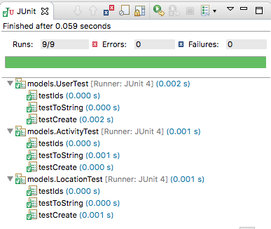

# Activity & Location Models

Introduce the following models:

## Activity

~~~
package models;

import static com.google.common.base.MoreObjects.toStringHelper;

import java.io.Serializable;
import java.util.ArrayList;
import java.util.List;
import java.util.UUID;

import com.google.common.base.Objects;

public class Activity implements Serializable {

  public String id;
  public String type;
  public String location;
  public double distance;
  public List<Location> route = new ArrayList<>();

  public Activity() {
  }

  public Activity(String type, String location, double distance, String start, String duration) {
    this.id = UUID.randomUUID().toString();
    this.type = type;
    this.location = location;
    this.distance = distance;
  }

  public String getId() {
    return id;
  }

  public String getType() {
    return type;
  }

  public String getLocation() {
    return location;
  }

  public String getDistance() {
    return Double.toString(distance);
  }

  public String getRoute() {
    return route.toString();
  }

  @Override
  public boolean equals(final Object obj) {
    if (obj instanceof Activity) {
      final Activity other = (Activity) obj;
      return Objects.equal(type, other.type)
          && Objects.equal(location, other.location)
          && Objects.equal(distance, other.distance)
          && Objects.equal(route, other.route);
    } else {
      return false;
    }
  }

  @Override
  public String toString() {
    return toStringHelper(this).addValue(id)
        .addValue(type)
        .addValue(location)
        .addValue(distance)
        .addValue(route)
        .toString();
  }

  @Override
  public int hashCode() {
    return Objects.hashCode(this.id, this.type, this.location, this.distance);
  }
}
~~~

## Location

~~~
package models;

import static com.google.common.base.MoreObjects.toStringHelper;

import java.io.Serializable;
import java.util.UUID;

import com.google.common.base.Objects;

public class Location implements Serializable {

  public String id;
  public double longitude;
  public double latitude;

  public Location() {
  }

  public Location(double latitude, double longitude) {
    this.id = UUID.randomUUID().toString();
    this.latitude = latitude;
    this.longitude = longitude;
  }

  @Override
  public boolean equals(final Object obj) {
    if (obj instanceof Location) {
      final Location other = (Location) obj;
      return Objects.equal(latitude, other.latitude)
          && Objects.equal(longitude, other.longitude);
    } else {
      return false;
    }
  }

  @Override
  public String toString() {
    return toStringHelper(this).addValue(id)
        .addValue(latitude)
        .addValue(longitude)
        .toString();
  }

  @Override
  public int hashCode() {
    return Objects.hashCode(this.id, this.latitude, this.longitude);
  }
}
~~~

## Tests

In `src/test/java` we can bring in our tests

First the Fixtures:

## Fixtures

~~~
package models;

import java.util.ArrayList;
import java.util.Arrays;
import java.util.List;

public class Fixtures {

  public static List<User> users = new ArrayList<>(Arrays.asList(
      new User("marge", "simpson", "marge@simpson.com", "secret"),
      new User("lisa", "simpson", "lisa@simpson.com", "secret"),
      new User("bart", "simpson", "bart@simpson.com", "secret"),
      new User("maggie", "simpson", "maggie@simpson.com", "secret")));
  
  public static List<Activity> activities = new ArrayList<>(Arrays.asList(
        new Activity("walk", "fridge", 0.001, "10:9:2017 09:00:00", "00:42:20"),
        new Activity("walk", "bar", 1.0, "11:9:2017 10:00:00", "00:39:02"),
        new Activity("run", "work", 2.2, "12:9:2017 08:00:00", "00:54:23"),
        new Activity("walk", "shop", 2.5, "13:9:2017 10:00:00", "00:32:03"),
        new Activity("cycle", "school", 4.5, "14:9:2017 11:00:00", "00:47:04")));

    public static List<Location> locations = new ArrayList<>(Arrays.asList(
        new Location(23.3, 33.3),
        new Location(34.4, 45.2),
        new Location(25.3, 34.3),
        new Location(44.4, 23.3)));
}
~~~

## LocationTest

~~~
package models;

import static org.junit.Assert.*;

import org.junit.Test;

import static models.Fixtures.locations;

public class LocationTest {

  @Test
  public void testCreate() {
    assertEquals(0.01, 23.3, locations.get(0).latitude);
    assertEquals(0.01, 33.3, locations.get(0).longitude);
  }

  @Test
  public void testIds() {
    assertNotEquals(locations.get(0).id, locations.get(1).id);
  }

  @Test
  public void testToString() {
    assertEquals("Location{" + locations.get(0).id + ", 23.3, 33.3}", locations.get(0).toString());
  }
}
~~~

## ActivityTest

~~~
package models;

import static org.junit.Assert.*;
import java.util.HashSet;
import java.util.Set;
import org.junit.Test;
import static models.Fixtures.activities;

public class ActivityTest {
  Activity test = new Activity("walk", "fridge", 0.001, "11:2:2012 9:00:00", "20:00:00");

  @Test
  public void testCreate() {
    assertEquals("walk", test.type);
    assertEquals("fridge", test.location);
    assertEquals(0.0001, 0.001, test.distance);
  }

  @Test
  public void testIds() {
    Set<String> ids = new HashSet<>();
    for (Activity activity : activities) {
      ids.add(activity.id);
    }
    assertEquals(activities.size(), ids.size());
  }

  @Test
  public void testToString() {
    assertEquals("Activity{" + test.id + ", walk, fridge, 0.001, []}", test.toString());
  }
}
~~~

All tests should now pass:

