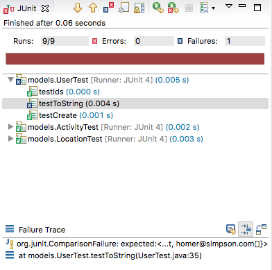

# Refining the Models

Currently User and Activity are independent classes. We would like to establish a one-to-many relationship. In this revised version, we establish the relationship:

## User

~~~
package models;

import static com.google.common.base.MoreObjects.toStringHelper;

import java.io.Serializable;
import java.util.HashMap;
import java.util.Map;
import java.util.UUID;

import com.google.common.base.Objects;

public class User implements Serializable {

  public String id;
  public String firstName;
  public String lastName;
  public String email;
  public String password;

  public Map<String, Activity> activities = new HashMap<>();

  public User() {
  }

  public String getId() {
    return id;
  }

  public String getFirstname() {
    return firstName;
  }

  public String getLastname() {
    return lastName;
  }

  public String getEmail() {
    return email;
  }

  public User(String firstName, String lastName, String email, String password) {
    this.id = UUID.randomUUID().toString();
    this.firstName = firstName;
    this.lastName = lastName;
    this.email = email;
    this.password = password;
  }

  @Override
  public boolean equals(final Object obj) {
    if (obj instanceof User) {
      final User other = (User) obj;
      return Objects.equal(firstName, other.firstName)
          && Objects.equal(lastName, other.lastName)
          && Objects.equal(email, other.email)
          && Objects.equal(password, other.password)
          && Objects.equal(activities, other.activities);
    } else {
      return false;
    }
  }

  @Override
  public String toString() {
    return toStringHelper(this).addValue(id)
        .addValue(firstName)
        .addValue(lastName)
        .addValue(password)
        .addValue(email)
        .addValue(activities)
        .toString();
  }

  @Override
  public int hashCode() {
    return Objects.hashCode(this.id, this.lastName, this.firstName, this.email, this.password, this.activities);
  }
}
~~~

This version causes one of our tests to fail:

The failure is in this test here:

~~~
  @Test
  public void testToString() {
    assertEquals("User{" + homer.id + ", homer, simpson, secret, homer@simpson.com",
        homer.toString());
  }
~~~

which doesnt take account of the relationship to Activities. This is a small update to make the tests pass again:

~~~
  @Test
  public void testToString() {
    assertEquals("User{" + homer.id + ", homer, simpson, secret, homer@simpson.com, {}}",
        homer.toString());
  }
~~~

We can introduce an additional test to exercise the User->Activity relationship:

~~~
  @Test
  public void tesAddActivity() {
    Activity activity = new Activity("walk", "fridge", 0.001, "11:2:2012 9:00:00", "20:00:00");
    homer.activities.put(activity.id,activity);
    System.out.println(homer);
    assertEquals("User{" + homer.id + ", homer, simpson, secret, homer@simpson.com, {" + activity.id + "=Activity{" + activity.id + ", walk, fridge, 0.001, []}}}",
        homer.toString());
  }
~~~  

