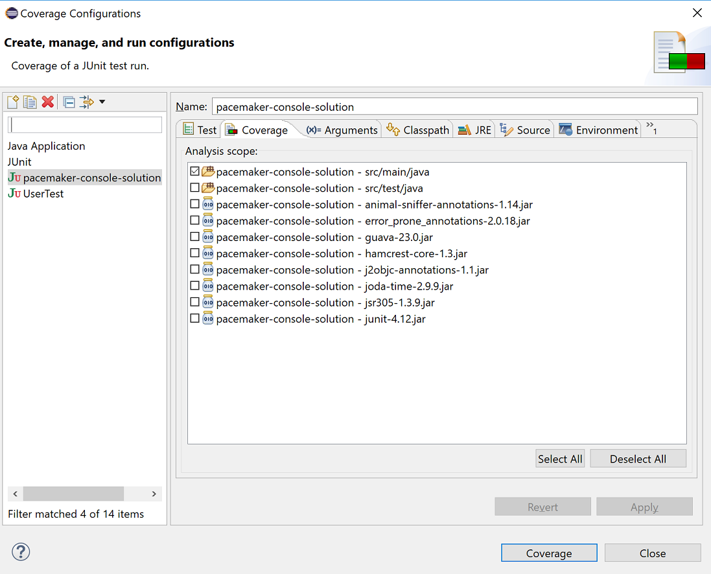
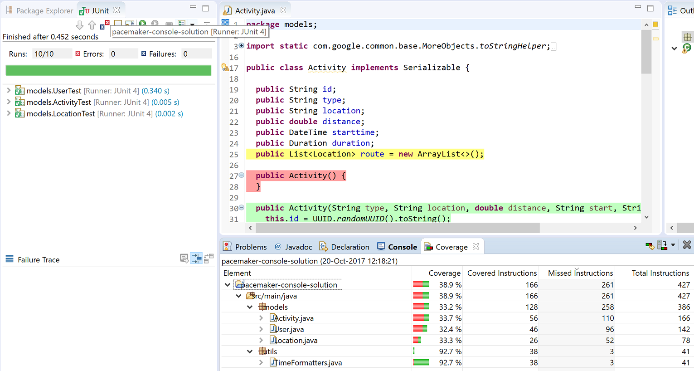
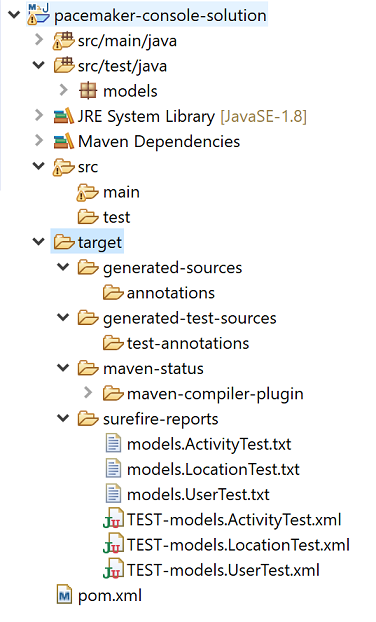

#  Exercises

Archive of the project so far can be found [here](archives/pacemaker-console-solution-7a-pre-exercises.zip). 

## Exercise 1: Maven test

Run the tests using the `mvn test` command. Verify that all tests pass, as is shown in the following output:

~~~
-------------------------------------------------------
 T E S T S
-------------------------------------------------------
Running models.ActivityTest
Tests run: 3, Failures: 0, Errors: 0, Skipped: 0, Time elapsed: 0.279 sec
Running models.LocationTest
Tests run: 3, Failures: 0, Errors: 0, Skipped: 0, Time elapsed: 0.001 sec
Running models.UserTest
Tests run: 4, Failures: 0, Errors: 0, Skipped: 0, Time elapsed: 0 sec

Results :

Tests run: 10, Failures: 0, Errors: 0, Skipped: 0

[INFO] ------------------------------------------------------------------------
[INFO] BUILD SUCCESS
[INFO] ------------------------------------------------------------------------
[INFO] Total time: 8.360 s
[INFO] Finished at: 2017-10-20T12:03:28+01:00
[INFO] Final Memory: 15M/125M
[INFO] ------------------------------------------------------------------------
~~~

## Exercise 2: Maven Coverage Reports

In Eclipse, select **Run**, followed by **Coverage...**.

When the Coverage Configurations window appears, click on the **Coverage** tab and confine the analysis to the **src/main/java** folder, as is shown below:

When you click the **Coverage** button, the JUnit tests should run and a coverage analysis presented to you:

This report clearly shows that our models need to have more JUnit tests written to bring up the percentage from the low 30's to a recommended coverage of 80%. 

Try adding in more tests and watch the % rise.

Note that running analysis on the coverage % does not generate any coverage reports to the *target* directory:

A good video on Eclipse Oxygen and Code Coverage in Practice (plus the history of code coverage):

- <https://www.youtube.com/watch?v=p_mVa9iNmzk>

You can export the coverage analyis:

- manually: **File**, **Export...**, **Run/Debug**, **Coverage Session**.
- via maven to the target directory: using the plugin below and running the **mvn jacoco:report** command.

~~~xml
				<plugin>
	                <groupId>org.jacoco</groupId>
	                <artifactId>jacoco-maven-plugin</artifactId>
	                <version>0.7.9</version>                      
	                <executions>
	                    <execution>
	                        <id>default-prepare-agent</id>
	                        <goals><goal>prepare-agent</goal></goals>
	                    </execution>
	                    <execution>
	                        <id>default-report</id>
	                        <phase>prepare-package</phase>
	                        <goals><goal>report</goal></goals>
	                    </execution>
	                </executions>
	            </plugin>
~~~

## The next lab...

With a set of models + unit tests + initial fixtures in place, we have a solid foundation for proceeding to implement the core API + console user interface (next lab).

