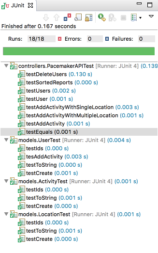

# PacemakerAPI

Create a new package called `controllers`, and introduce this first version if the API:

## PacemakerAPI

~~~
import java.util.ArrayList;
import java.util.Collection;
import java.util.HashMap;
import java.util.List;
import java.util.Map;
import com.google.common.base.Optional;
import models.Activity;
import models.Location;
import models.User;
import org.joda.time.DateTimeComparator;

public class PacemakerAPI {

  private Map<String, User> emailIndex = new HashMap<>();
  private Map<String, User> userIndex = new HashMap<>();
  private Map<String, Activity> activitiesIndex = new HashMap<>();

  public PacemakerAPI() {}

  public Collection<User> getUsers() {
    return userIndex.values();
  }

  public void deleteUsers() {
    userIndex.clear();
    emailIndex.clear();
  }

  public User createUser(String firstName, String lastName, String email, String password) {
    User user = new User(firstName, lastName, email, password);
    emailIndex.put(email, user);
    userIndex.put(user.id, user);
    return user;
  }

  public Activity createActivity(String id, String type, String location, double distance,
      String starttime, String duration) {
    Activity activity = null;
    Optional<User> user = Optional.fromNullable(userIndex.get(id));
    if (user.isPresent()) {
      activity = new Activity(type, location, distance, starttime, duration);
      user.get().activities.put(activity.id, activity);
      activitiesIndex.put(activity.id, activity);
    }
    return activity;
  }

  public Activity getActivity(String id) {
    return activitiesIndex.get(id);
  }

  public Collection<Activity> getActivities(String id) {
    Collection<Activity> activities = null;
    Optional<User> user = Optional.fromNullable(userIndex.get(id));
    if (user.isPresent()) {
      activities = user.get().activities.values();
    }
    return activities;
  }

  public List<Activity> listActivities(String userId, String sortBy) {
    return null;
  }

  public void addLocation(String id, double latitude, double longitude) {
    Optional<Activity> activity = Optional.fromNullable(activitiesIndex.get(id));
    if (activity.isPresent()) {
      activity.get().route.add(new Location(latitude, longitude));
    }
  }

  public User getUserByEmail(String email) {
    return emailIndex.get(email);
  }

  public User getUser(String id) {
    return userIndex.get(id);
  }

  public User deleteUser(String id) {
    User user = userIndex.remove(id);
    return emailIndex.remove(user.email);
  }
}
~~~

This does not include the serialization support, or the more advanced activity reports.

This the corresponding test - which should be created in the `src/test/controllers` package:

## PacemakerAPITest

~~~
package controllers;

import static org.junit.Assert.*;

import java.util.List;
import org.joda.time.DateTimeComparator;
import org.junit.After;
import org.junit.Before;
import org.junit.Test;

import models.Activity;
import models.Location;
import models.User;

import static utils.TimeFormatters.parseDateTime;
import static utils.TimeFormatters.parseDuration;

import static models.Fixtures.users;
import static models.Fixtures.activities;
import static models.Fixtures.locations;
import static models.Fixtures.margeActivities;

public class PacemakerAPITest {

  private PacemakerAPI pacemaker;

  void assertEquivalent(List<Activity> list1, List<Activity> list2) {
    assertEquals(list1.size(), list1.size());
    int index = 0;
    for (Activity activity : list1) {
      assertEquals(activity.location, list2.get(index).location);
      index++;
    }
  }
  
  @Before
  public void setup() {
    pacemaker = new PacemakerAPI();
    users.forEach(
        user -> pacemaker.createUser(user.firstName, user.lastName, user.email, user.password));
  }

  @After
  public void tearDown() {
    pacemaker = null;
  }

  @Test
  public void testUser() {
    assertEquals(users.size(), pacemaker.getUsers().size());
    pacemaker.createUser("homer", "simpson", "homer@simpson.com", "secret");
    assertEquals(users.size() + 1, pacemaker.getUsers().size());
    assertEquals(users.get(0), pacemaker.getUserByEmail(users.get(0).email));
  }

  @Test
  public void testEquals() {
    User homer = new User("homer", "simpson", "homer@simpson.com", "secret");
    User homer2 = new User("homer", "simpson", "homer@simpson.com", "secret");
    User bart = new User("bart", "simpson", "bartr@simpson.com", "secret");

    assertEquals(homer, homer);
    assertEquals(homer, homer2);
    assertNotEquals(homer, bart);

    assertSame(homer, homer);
    assertNotSame(homer, homer2);
  }

  @Test
  public void testUsers() {
    assertEquals(users.size(), pacemaker.getUsers().size());
    users.forEach(user -> {
      User eachUser = pacemaker.getUserByEmail(user.email);
      assertEquals(user, eachUser);
      assertNotSame(user, eachUser);
    });
  }

  @Test
  public void testDeleteUsers() {
    assertEquals(users.size(), pacemaker.getUsers().size());
    User marge = pacemaker.getUserByEmail("marge@simpson.com");
    pacemaker.deleteUser(marge.id);
    assertEquals(users.size() - 1, pacemaker.getUsers().size());
  }

  @Test
  public void testAddActivity() {
    User marge = pacemaker.getUserByEmail("marge@simpson.com");
    Activity testActivity = margeActivities.get(0);
    Activity activity = pacemaker
        .createActivity(marge.id, testActivity.type, testActivity.location, testActivity.distance,
            parseDateTime(testActivity.starttime), parseDuration(testActivity.duration));
    Activity returnedActivity = pacemaker.getActivity(activity.id);
    assertEquals(activities.get(0), returnedActivity);
    assertNotSame(activities.get(0), returnedActivity);
  }

  @Test
  public void testAddActivityWithSingleLocation() {
    User marge = pacemaker.getUserByEmail("marge@simpson.com");
    Activity testActivity = margeActivities.get(0);
    String activityId = pacemaker
        .createActivity(marge.id, testActivity.type, testActivity.location, testActivity.distance,
            parseDateTime(testActivity.starttime), parseDuration(testActivity.duration)).id;

    pacemaker.addLocation(activityId, locations.get(0).latitude, locations.get(0).longitude);

    Activity activity = pacemaker.getActivity(activityId);
    assertEquals(1, activity.route.size());
    assertEquals(0.0001, locations.get(0).latitude, activity.route.get(0).latitude);
    assertEquals(0.0001, locations.get(0).longitude, activity.route.get(0).longitude);
  }

  @Test
  public void testAddActivityWithMultipleLocation() {
    User marge = pacemaker.getUserByEmail("marge@simpson.com");
    Activity testActivity = margeActivities.get(0);
    String activityId = pacemaker
        .createActivity(marge.id, testActivity.type, testActivity.location, testActivity.distance,
            parseDateTime(testActivity.starttime), parseDuration(testActivity.duration)).id;

    locations.forEach(
        location -> pacemaker.addLocation(activityId, location.latitude, location.longitude));

    Activity activity = pacemaker.getActivity(activityId);
    assertEquals(locations.size(), activity.route.size());

    int i = 0;
    for (Location location : activity.route) {
      assertEquals(location, locations.get(i));
      i++;
    }
  }

  @Test
  public void testSortedReports() {
  }
}
~~~

##Fixtures

Add the following fixtures to the 'models/Fixtures' class:

~~~java
  public static List<Activity> margeActivities =
      new ArrayList<>(Arrays.asList(activities.get(0), activities.get(1)));

  public static List<Activity> lisasActivities =
      new ArrayList<>(Arrays.asList(activities.get(2), activities.get(3)));

  public static List<Location> route1 =
      new ArrayList<>(Arrays.asList(locations.get(0), locations.get(1)));

  public static List<Location> route2 =
      new ArrayList<>(Arrays.asList(locations.get(2), locations.get(3)));

  public static List<Activity> activitiesSortedByType =
      new ArrayList<>(Arrays.asList(activities.get(4), activities.get(2), activities.get(1),
          activities.get(0), activities.get(3)));
~~~ 

##Testing

The new tests should pass - along with all of the others:

We now have a substantial body of test, which can give us the confidence (and a safety net) as we proceed to implement the remaining features.

