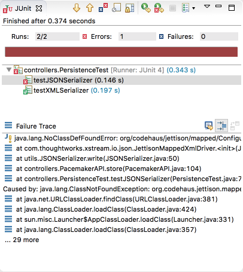

# PacemakerAPI JSON Serialization 

Introduce an alternative version of the Serializer into the `utils` package, this time to use s JSON driver:

## JSONSerializer

~~~
package utils;

import com.thoughtworks.xstream.XStream;
import com.thoughtworks.xstream.io.json.JettisonMappedXmlDriver;
import com.thoughtworks.xstream.io.xml.DomDriver;

import java.io.File;
import java.io.FileReader;
import java.io.FileWriter;
import java.io.ObjectInputStream;
import java.io.ObjectOutputStream;
import java.util.Stack;

public class JSONSerializer implements Serializer {

  private Stack stack = new Stack();
  private File file;

  public JSONSerializer(File file) {
    this.file = file;
  }

  public void push(Object o) {
    stack.push(o);
  }

  public Object pop() {
    return stack.pop();
  }

  @SuppressWarnings("unchecked")
  public void read() throws Exception {
    ObjectInputStream is = null;

    try {
      XStream xstream = new XStream(new JettisonMappedXmlDriver());
      is = xstream.createObjectInputStream(new FileReader(file));
      stack = (Stack) is.readObject();
    } finally {
      if (is != null) {
        is.close();
      }
    }
  }

  public void write() throws Exception {
    ObjectOutputStream os = null;

    try {
      XStream xstream = new XStream(new JettisonMappedXmlDriver());
      os = xstream.createObjectOutputStream(new FileWriter(file));
      os.writeObject(stack);
    } finally {
      if (os != null) {
        os.close();
      }
    }
  }
}
~~~

We can try the following new test in PersistenceTest:

## PersistenceTest

~~~
  @Test
  public void testJSONSerializer() throws Exception {
    Serializer jsonSerializer = new JSONSerializer(new File("datastore.json"));
    pacemaker.serializer = jsonSerializer;
    pacemaker.store();
    PacemakerAPI pacemaker2 = new PacemakerAPI(null);
    pacemaker2.serializer = jsonSerializer;
    pacemaker2.load();
    pacemaker.getUsers().forEach(user -> assertTrue(pacemaker2.getUsers().contains(user)));
  }
~~~

Run the test now. It should fail:

This failure is caused by an exception in the xtsream library - not an assertion failure in our tests. The exception is because one of the upstream dependencies of xstream is not explicitly included into our POM.

Introducing this additional dependency should correct the problem:

~~~
    <dependency>
      <groupId>org.codehaus.jettison</groupId>
      <artifactId>jettison</artifactId>
      <version>1.3.8</version>
    </dependency>
~~~

The tests should now pass.

