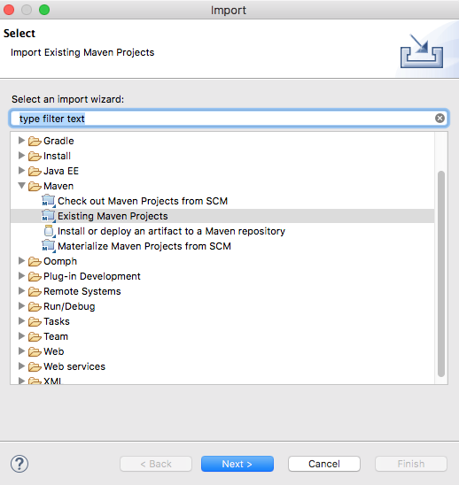
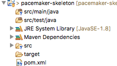

# Setup

Create a new folder to contain the project. To might call it 'pacemaker-skeleton'

## Directory Structure

In this folder, create the following directory structure:

~~~
pacemaker-skeleton
     │
     └── src
         │
         ├── main
         │   │ 
         │   └──java
         │
         └── test
             │
             └──java
 ~~~

## pom.xml

In the root of the folder, create the pom.xml file:

~~~
<project xmlns="http://maven.apache.org/POM/4.0.0" xmlns:xsi="http://www.w3.org/2001/XMLSchema-instance"
  xsi:schemaLocation="http://maven.apache.org/POM/4.0.0 http://maven.apache.org/xsd/maven-4.0.0.xsd">
  <modelVersion>4.0.0</modelVersion>

  <groupId>pacemaker</groupId>
  <artifactId>pacemaker-skeleton</artifactId>
  <version>1.0-SNAPSHOT</version>
  <packaging>jar</packaging>

  <name>pacemaker-skeleton</name>
  <url>http://maven.apache.org</url>

  <properties>
    <project.build.sourceEncoding>UTF-8</project.build.sourceEncoding>
    <maven.compiler.source>1.8</maven.compiler.source>
    <maven.compiler.target>1.8</maven.compiler.target>
  </properties>

  <build>
    <plugins>
      <plugin>
        <groupId>org.apache.maven.plugins</groupId>
        <artifactId>maven-compiler-plugin</artifactId>
        <configuration>
          <source>1.8</source>
          <target>1.8</target>
        </configuration>
      </plugin>
    </plugins>
  </build>

  <dependencies>
    <dependency>
      <groupId>junit</groupId>
      <artifactId>junit</artifactId>
      <version>4.12</version>
      <scope>test</scope>
    </dependency>
    <dependency>
      <groupId>com.google.guava</groupId>
      <artifactId>guava</artifactId>
      <version>23.0</version>
    </dependency>
    <dependency>
      <groupId>asg-cliche</groupId>
      <artifactId>asg-cliche</artifactId>
      <version>1.0</version>
    </dependency>
    <dependency>
      <groupId>java-ascii-table</groupId>
      <artifactId>java-ascii-table</artifactId>
      <version>1.0</version>
    </dependency>
  </dependencies>
</project>
~~~

if you are using git, you might wish to use this .gitignore:

~~~
.idea
target
*.iml
.settings
.classpath
.project
~~~

We can now bring this project into Eclipse. Select File-Import, and locate Maven->Existing Maven Project:

The project should look like this:

