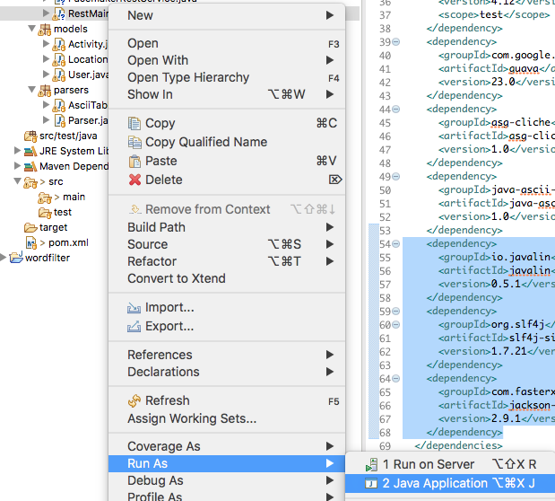

# Start Rest Service

The existing main launches a simple console application.

Keeping this main as is, we can augment this with another main, this time it will start a web server :

## RestMain

~~~
package controllers;

import io.javalin.Javalin;

public class RestMain {

  public static void main(String[] args) throws Exception {
    Javalin app = Javalin.start(7000);
  }
}
~~~

You should be able to launch this by right-clicking RestMain and selecting 'Run as->Java Application'

The console should look like this:

~~~
_________________________________________
|        _                  _ _           |
|       | | __ ___   ____ _| (_)_ __      |
|    _  | |/ _` \ \ / / _` | | | '_ \     |
|   | |_| | (_| |\ V / (_| | | | | | |    |
|    \___/ \__,_| \_/ \__,_|_|_|_| |_|    |
|_________________________________________|
|                                         |
|    https://javalin.io/documentation     |
|_________________________________________|
[main] INFO io.javalin.Javalin - Starting Javalin ...
[main] INFO org.eclipse.jetty.server.Server - jetty-9.4.6.v20170531
[main] INFO org.eclipse.jetty.server.session - DefaultSessionIdManager workerName=node0
[main] INFO org.eclipse.jetty.server.session - No SessionScavenger set, using defaults
[main] INFO org.eclipse.jetty.server.session - Scavenging every 600000ms
[main] INFO org.eclipse.jetty.server.handler.ContextHandler - Started o.e.j.s.ServletContextHandler@cb5822{/,null,AVAILABLE}
[main] INFO org.eclipse.jetty.server.AbstractConnector - Started ServerConnector@6d4b1c02{HTTP/1.1,[http/1.1]}{0.0.0.0:7000}
[main] INFO org.eclipse.jetty.server.Server - Started @560ms
[main] INFO io.javalin.embeddedserver.EmbeddedServer - Jetty is listening on: [http://localhost:7000]
[main] INFO io.javalin.Javalin - Javalin has started \o/
~~~

If you now browse to:

- <http://localhost:7000/>

Your browser should display:

~~~
Not found
~~~

You now have a web service running on localhost - it doesnt expose any endpoints yet, so accessing it delivers a 'not found' response.

If you open Chrome developer tools - you might be able to see a little more detail:

