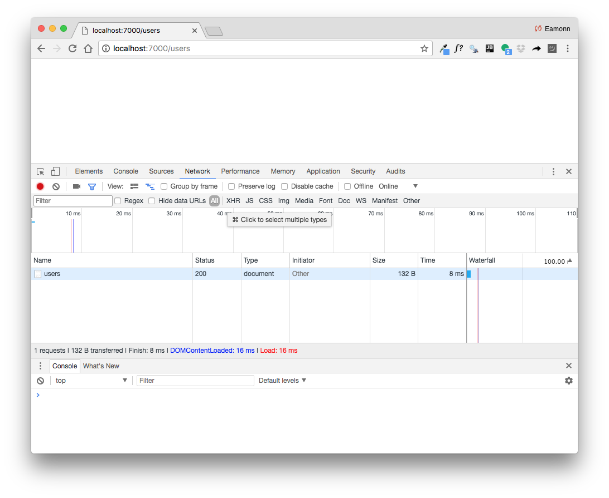

# First End Point

Introduce the folowing class into the controllers package:

## PacemakerRestService

~~~
package controllers;

import io.javalin.Context;

public class PacemakerRestService {

  PacemakerAPI pacemaker = new PacemakerAPI();

  public void listUsers(Context ctx) {
  }
}
~~~

We are implementing a single endpoint to retrieve a list of users.

Attaching the end point to the server, we need to refactor RestMain as follows:

~~~
package controllers;

import io.javalin.Javalin;

public class RestMain {

  public static void main(String[] args) throws Exception {
    Javalin app = Javalin.start(7000);
    PacemakerRestService service = new PacemakerRestService();
    configRoutes(app, service);
  }

  static void configRoutes(Javalin app, PacemakerRestService service) {

    app.get("/users", ctx -> {
      service.listUsers(ctx);
    });
  }
}
~~~

Examine the above carefully. 

Via the **Console** window, **Terminate** the previous run of your app. 

Then **Restart** the app and open a browser on this url:

- <http://localhost:7000/users>

This time the response will be blank - but if you can locate the Chrome developer console it might look like this:

This indicates the endpoint was found this time (status 200), but no value was returned.

