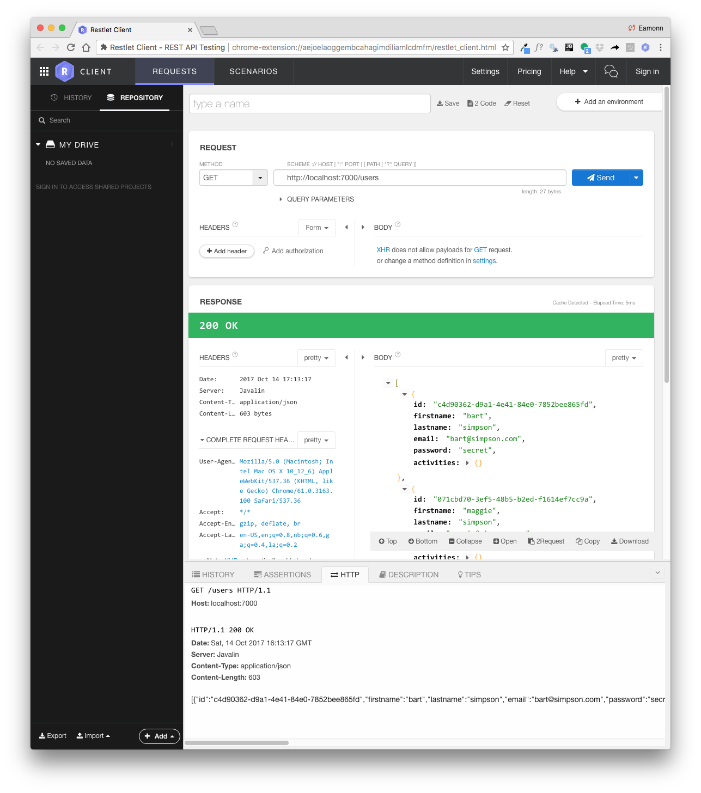

# Sample Data

We can carry over some fixtures from our previous solution:

## fixtures
~~~
package models;

import java.util.ArrayList;
import java.util.Arrays;
import java.util.List;

public class Fixtures {

  public static List<User> users =
      new ArrayList<>(Arrays.asList(new User("marge", "simpson", "marge@simpson.com", "secret"),
          new User("lisa", "simpson", "lisa@simpson.com", "secret"),
          new User("bart", "simpson", "bart@simpson.com", "secret"),
          new User("maggie", "simpson", "maggie@simpson.com", "secret")));
}
~~~

This creates a list of test users.

We can now rework our PacemakerRestService to return this list:

~~~
package controllers;

import io.javalin.Context;
import static models.Fixtures.users;

public class PacemakerRestService {

  PacemakerAPI pacemaker = new PacemakerAPI();

  PacemakerRestService() {
    users.forEach(
        user -> pacemaker.createUser(user.firstName, user.lastName, user.email, user.password));
  }

  public void listUsers(Context ctx) {
    ctx.json(pacemaker.getUsers());
  }
}
~~~

Terminate the existing app, restart it and browse to the same endpoint:

- <http://localhost:7000/users>

The following list should be returned:

Looking carefully as the result, we see a slight anomaly in each user returned:

~~~
{
  "id":"8179fe9a-3dfa-4a9c-8835-4c044d35471d",
  "firstName":"marge",
  "lastName":"simpson",
  "email":"marge@simpson.com",
  "password":"secret",
  "activities":{},
  "firstname":"marge",
  "lastname":"simpson"
}
~~~

.. we seem to be repeating the firstname/lastname pair. Our Json parsers cannot cope very well with camel-case attribute. We can fix this now using the Refactor->rename facility in Eclipse:

This will change the fields names, and all uses thereof in the application:

~~~
public class User implements Serializable {

  public String id;
  public String firstname;
  public String lastname;
  public String email;
  public String password
~~~  

Restart, and verify that Users are returned as expected:

~~~
{
  "id":"8179fe9a-3dfa-4a9c-8835-4c044d35471d",
  "firstName":"marge",
  "lastName":"simpson",
  "email":"marge@simpson.com",
  "password":"secret",
  "activities":{}
}
~~~

We can also test this endpoint using specialized REST tools. Locate the `Restlet Client` Chrome extension:

and install it.

Launch the extension, and create a 'GET' request to our endpoint. Note the request is in the top of the page and the results are below the green bar.  Also note that you must have your REST server running to execute these endpoints.

Explore this tool for a few minutes - including the `history` and `repository` sections.

