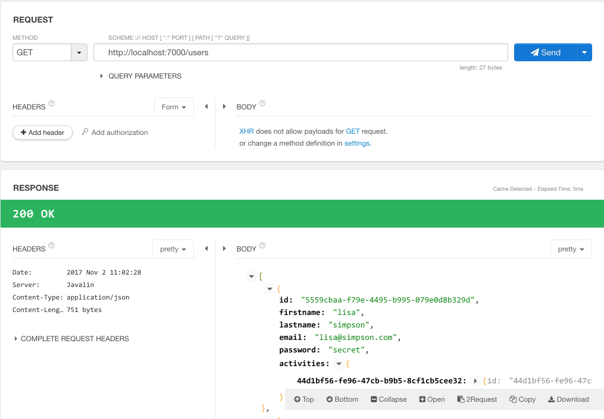

# Activities

Now that users are supported - we can implement initial activity support.

First 2 new routes:

~~~
    app.get("/users/:id/activities", ctx -> {
      service.getActivities(ctx);
    });

    app.post("/users/:id/activities", ctx -> {
      service.createActivity(ctx);
    });
~~~

This will get all activities for a given user, and also create single activity for a user. This is the implementation of these routes:

~~~
  public void getActivities(Context ctx) {
    String id = ctx.param("id");
    User user = pacemaker.getUser(id);
    if (user != null) {
      ctx.json(user.activities.values());
    } else {
      ctx.status(404);
    }
  }

  public void createActivity(Context ctx) {
    String id = ctx.param("id");
    User user = pacemaker.getUser(id);
    if (user != null) {
      Activity activity = ctx.bodyAsClass(Activity.class);
      Activity newActivity = pacemaker
          .createActivity(id, activity.type, activity.location, activity.distance);
      ctx.json(newActivity);
    } else {
      ctx.status(404);
    }
  }
~~~

In each case, we interrogate the context for the user id - and we use this id to discover which user the activities are associated with. Our API is then accessed - and we return the list of all activities, or the individual activity just created.

Testing these routes requires REST tools - we have already installed Restlet in Chrome.

First, retrieve all users:

Using the first id - formulate a `POST` request. Copy the json object for the new activity:

~~~
{
  "type": "walk",
  "location" : "fridge",
  "distance" : 2
}
~~~

Press send - and we should expect a successful response (you may have to scroll down to see the response):

Finally, test the get all activities route:

Which returns the activity just created - in a list.

