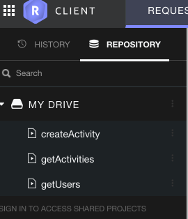

# Exercises

# Solution

The project so far:

- <https://github.com/wit-computing-msc-2017/pacemaker-skeleton/releases/tag/lab09.end>

## Exercises 1

Restlet Client has a feature whereby requests can be saved for reuse later:

Experiment with creating additional activities and listing all activities, using this feature.

## Exercise 2

Examine the following route:

~~~
    app.get("/users/:id/activities/:activityId", ctx -> {
      service.getActivity(ctx);
    });
~~~

This retrieves a single activity by id. Implement the `getActivity()` method in `PacemkerRestService`. 

Test this route using the Restlet Client.

## Exercise 3

Two final routes:

~~~
    app.get("/users/:id/activities/:activityId/locations", ctx -> {
      service.getActivityLocations(ctx);
    });
    
    app.post("/users/:id/activities/:activityId/locations", ctx -> {
      service.addLocation(ctx);
    });
~~~

See if you can implement them?