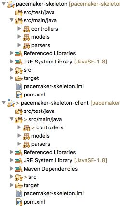
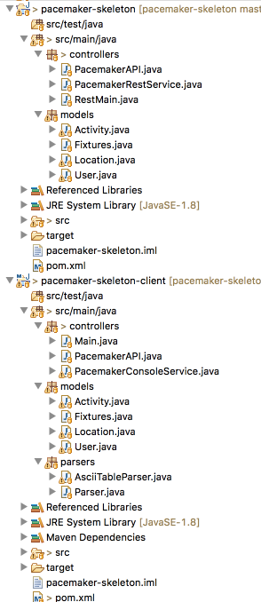
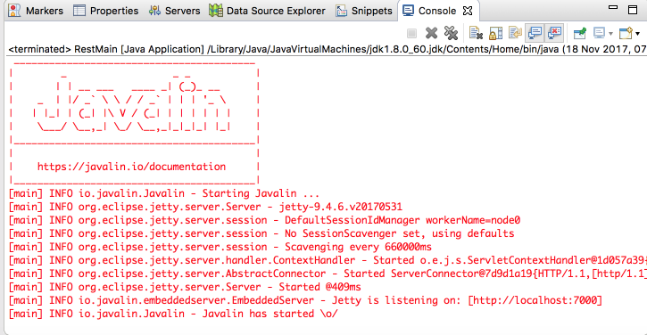

# pacemker-skeleton-client project

In Eclipse, you should have a pacemaker-skeleton project, as completed from Lab09. This is an archive of the completed project including exercise solutions:

- <https://github.com/wit-computing-msc-2017/pacemaker-skeleton/releases/tag/lab09.exercises>

Using either the above project, or your own solution:

- Create a copy of the project, calling the new folder `pacemaker-skeleton-client`
- Open the `pom.xml` file, and change the project **name** and **artifact id** to `pacemaker-skeleton-client`:

    ~~~
      <name>pacemaker-skeleton-client</name>
    ~~~

- Import the `pacemaker-skeleton-client` project (as a maven project) into Eclipse.

Your eclipse project should look like this:

Note that you should have 2 identical projects named:

- pacemaker-skeleton   *(the project you built using last week's labs)*
- pacemaker-skeleton-client   *(the project you just imported )*

Both implement identical features:

- a REST API for the pacemaker service (via controllers.RestMain)
- a command line application for the pacemaker service (via controllers.Main)

We would like to progressively diverge these two applications such that:

- `pacemaker-skeleton` -> Expose REST API only, removing the CLI
- `pacemaker-skeleton-client` -> Command line application only, removing the existing pacemaker implementation

The client application will ultimately utilize the REST API exposed by the service.

## First Steps

Simplifying `pacemaker-skeleton` is relatively straightforward. Delete the following source files from the project:

- controllers.PacemakerConsoleService
- controllers.Main
- controlers.parsers.Parser
- controllers.parsers.AsciiTableParser

You can also delete the, now empty, 'parsers' package.

In the `pacemaker-skeleton-client` project, remove these classes:

- controllers.PacemakerRestService
- controllers.RestMain
- models.Fixtures

In addition, edit the `pacemaker-skeleton-client` pom file, and remove the javalin dependencies:

~~~
    <dependency>
      <groupId>io.javalin</groupId>
      <artifactId>javalin</artifactId>
      <version>0.5.1</version>
    </dependency>
    <dependency>
      <groupId>org.slf4j</groupId>
      <artifactId>slf4j-simple</artifactId>
      <version>1.7.21</version>
    </dependency>
    <dependency>
      <groupId>com.fasterxml.jackson.core</groupId>
      <artifactId>jackson-databind</artifactId>
      <version>2.9.1</version>
    </dependency>
~~~

Both projects should look like this:

The server (`pacemaker-skeleton`) should be working fine as is - run it to make sure there are no errors:

