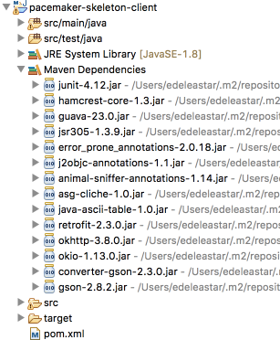

# Retrofit

In the client (`pacemaker-skeleton-client`) introduce the following new dependencies into pom.xml:

~~~
  <dependency>
    <groupId>com.squareup.retrofit2</groupId>
    <artifactId>retrofit</artifactId>
    <version>2.3.0</version>
  </dependency>
  <dependency>
    <groupId>com.squareup.retrofit2</groupId>
    <artifactId>converter-gson</artifactId>
    <version>2.3.0</version>
  </dependency>
  <dependency>
    <groupId>com.google.code.gson</groupId>
    <artifactId>gson</artifactId>
    <version>2.8.2</version>
  </dependency>
~~~

When you save the pom in eclipse, you will have a range of additional libraries downloaded and referenced by the application:

We now start to work on implementing the Client API:

Start by declaring this new interface inside the PacemakerAPI source file:

~~~
import retrofit2.Call;
import retrofit2.http.GET;

interface PacemakerInterface
{
  @GET("/users")
  Call<List<User>> getUsers();
}
~~~

Place this interface just before the existing PacemakerAPI class and after the existing import statements.

Now make the following changes to the PacemakerAPI:

- introduce a new attribute `pacemakerInterface`
- replace the existing empty default constructor 

~~~
public class PacemakerAPI {

  PacemakerInterface pacemakerInterface;

  public PacemakerAPI(String url) {
    Gson gson = new GsonBuilder().create();
    Retrofit retrofit = new Retrofit.Builder().baseUrl(url)
        .addConverterFactory(GsonConverterFactory.create(gson)).build();
    pacemakerInterface = retrofit.create(PacemakerInterface.class);
  }
~~~

Import the appropriate libraries as prompted by Eclipse auto-correct. If you are having difficulty with the imports, this is the complete revised class at this stage:

~~~
package controllers;

import java.util.Collection;
import java.util.List;
import com.google.gson.Gson;
import com.google.gson.GsonBuilder;
import models.Activity;
import models.Location;
import models.User;
import retrofit2.Call;
import retrofit2.Retrofit;
import retrofit2.converter.gson.GsonConverterFactory;
import retrofit2.http.GET;

interface PacemakerInterface
{
	@GET("/users")
	Call<List<User>> getUsers();
}

public class PacemakerAPI {

	PacemakerInterface pacemakerInterface;

	public PacemakerAPI(String url) {
		Gson gson = new GsonBuilder().create();
		Retrofit retrofit = new Retrofit.Builder().baseUrl(url)
				.addConverterFactory(GsonConverterFactory.create(gson)).build();
		pacemakerInterface = retrofit.create(PacemakerInterface.class);
	}
	public Collection<User> getUsers() {
		return null;
	}

	public void deleteUsers() {
	}

	public User createUser(String firstName, String lastName, String email, String password) {
		return null;    
	}

	public Activity createActivity(String id, String type, String location, double distance) {
		return null;
	}

	public Activity getActivity(String id) {
		return null;
	}

	public Collection<Activity> getActivities(String id) {
		return null;
	}

	public List<Activity> listActivities(String userId, String sortBy) {
		return null;
	}

	public void addLocation(String id, double latitude, double longitude) {
	}

	public User getUserByEmail(String email) {
		return null;
	}

	public User getUser(String id) {
		return null;
	}

	public User deleteUser(String id) {
		return null;
	}
}
~~~

There will be an error in PacemakerConsoleService class on this line:

~~~
  private PacemakerAPI paceApi = new PacemakerAPI();
~~~

This constructor requires a parameter - which will be the url of the API. We will be running the service on our local machine, so this change will do for the moment:

~~~
  private PacemakerAPI paceApi = new PacemakerAPI("http://localhost:7000");
~~~

The project should now compile without errors.
