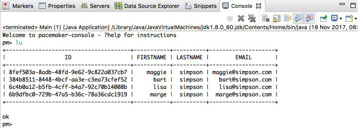
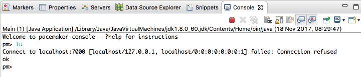
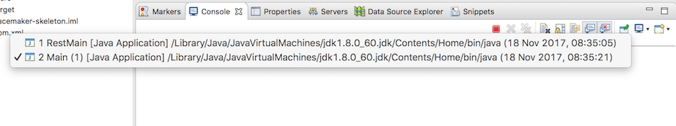
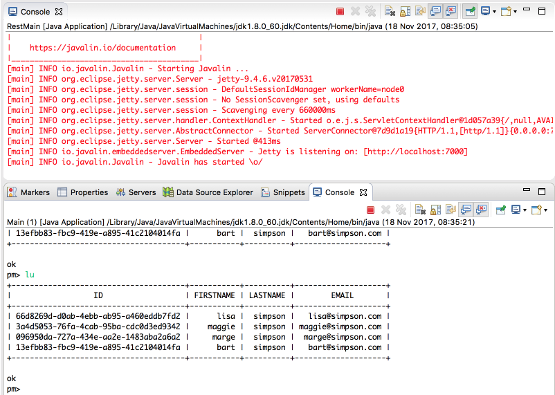
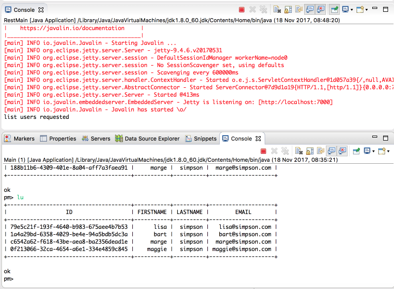

# PacemakerAPI 

We can implement our first command now in the PacemakerAPI class in the client. Start with the the `getUsers` command;

~~~java
  public Collection<User> getUsers() {
    Collection<User> users = null;
    try {
      Call<List<User>> call = pacemakerInterface.getUsers();
      Response<List<User>> response = call.execute();
      users = response.body();
    } catch (Exception e) {
      System.out.println(e.getMessage());
    }
    return users;
  }
~~~

You will need this import statement too:

~~~java
import retrofit2.Response;
~~~

If the server project (pacemaker-skeleton) is running, then this `lu` command should work now:

This is rendereing the test users loaded by the server application. If the server is not running, then you will get an error like this:

Running two applications in a single eclipse workspace can be a little challenging. The Console view in Eclipse has a tool bar button called `Display Selected Console` (on the extreme right of the tool bar). Selecting it will either list the available console (one per application running), or allow you to list them and select one:

In addition, using a combination of the `New Console View`, `Pin Console` and drag and drop within eclipse, it should be possible to rearrange the IDE to display the two consoles simultaneously:

It might be worth spending a little time experimenting with Eclipse until you can assemble the consoles as shown above. be user to experiment with the `Pin Console` button, which will prevent the console from altering to always display the most recently active console.

We could include some log statements in the pacemaker-skeleton server to aid debugging:

## ParemakerRestService

~~~
  public void listUsers(Context ctx) {
    ctx.json(pacemaker.getUsers());
    System.out.println("list users requested");
  }
~~~

## Revist the two projects to take stock of the content in each

Before moving on, it might be a good idea, at this stage of the lab, to revisit the contents of both projects and broadly familiarise yourself with the workings of each.

