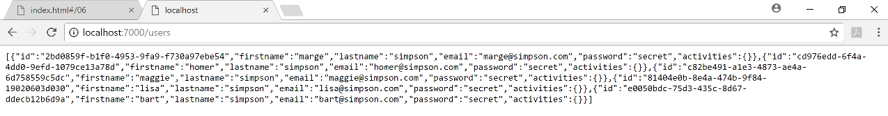
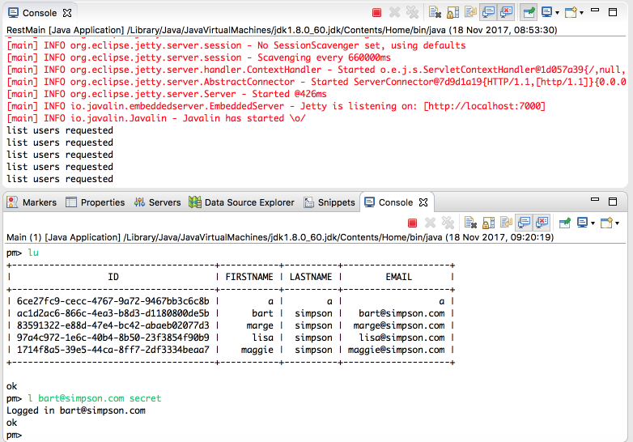

# Register & Login Commands

We can now start to implement additional commands. Each command will typically need both an Interface and API methods.

## Register User

Starting with creating a new user. Introduce new method into the PacemakerInterface :

~~~
  @POST("/users")
  Call<User> registerUser(@Body User User);
~~~

(Bring in the appropriate imports)

And then this is the `createUser()` API command implementation:

~~~
  public User createUser(String firstName, String lastName, String email, String password) {
    User returnedUser = null;
    try {
      Call<User> call = pacemakerInterface.registerUser(new User(firstName, lastName, email, password));
      Response<User> response = call.execute();
      returnedUser = response.body();    
    } catch (Exception e) {
      System.out.println(e.getMessage());
    }
    return returnedUser;
  }
~~~

Restart the client - and try this command:

~~~
pm> r homer simpson homer@simpson.com secret
~~~

Which should respond with a new user:

~~~
+--------------------------------------+-----------+----------+-------------------+
|                  ID                  | FIRSTNAME | LASTNAME |       EMAIL       |
+--------------------------------------+-----------+----------+-------------------+
| cf67ed43-77c9-46cd-8e1a-b21930916b42 |     homer |  simpson | homer@simpson.com |
+--------------------------------------+-----------+----------+-------------------+
~~~

Listing all users should respond with:

~~~
pm> lu
+--------------------------------------+-----------+----------+--------------------+
|                  ID                  | FIRSTNAME | LASTNAME |        EMAIL       |
+--------------------------------------+-----------+----------+--------------------+
| 31509d53-80fd-4b75-8aa1-a1c23cbd9146 |    maggie |  simpson | maggie@simpson.com |
| eb24cf06-c94c-409c-a1b7-2fcb7f4a3356 |      bart |  simpson |   bart@simpson.com |
| 27a8a0eb-7f96-4155-ad97-b241ce8d504e |      lisa |  simpson |   lisa@simpson.com |
| 25f5a591-410d-4352-8b46-582b6c19785c |     marge |  simpson |  marge@simpson.com |
| cf67ed43-77c9-46cd-8e1a-b21930916b42 |     homer |  simpson |  homer@simpson.com |
+--------------------------------------+-----------+----------+--------------------+
 
ok
pm> 
~~~

You can also see the **homer simpson** user by navigating to your local host, port 7000 via your browser.

## Login a user

This is our `getUserByEmail()` implementation:

~~~
  public User getUserByEmail(String email) {
    Collection<User> users = getUsers();
    User foundUser = null;
    for (User user : users) {
      if (user.email.equals(email)) {
        foundUser = user;
      }
    }
    return foundUser;
  }
~~~

Notice that this is rather inefficient - as we request all users, and then once we have fetched them we search of the user by email. Alternative strategies would involve introducing a new api to fetch user details by email explicitly. We will stick to this implementation for the moment. 

With this method implemented, out CLI should allow us to log in:

We can register new users, list all users and login and logout (try all these commands). Remember, we are operating a client CLI application, using an API hosted on our local machine. 

If, somehow, we could move the server application to another machine (in the cloud), then it could support multiple user logins - and the planned features would start to become useful.

Recall, our client application is 'bound' to the local url on creation:

~~~
  private PacemakerAPI paceApi = new PacemakerAPI("http://localhost:7000");
~~~

We could, theoretically, bind it to a service located at any url.
