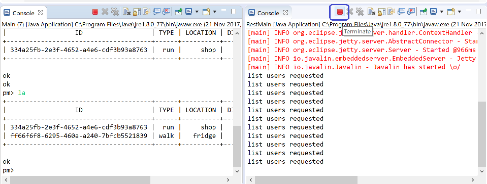

## AddActivity & ListActivity Commands

Here are implementations of createActivity & getActivities commands:

~~~
  public Activity createActivity(String id, String type, String location, double distance) {
    Activity returnedActivity = null;
    try {
      Call<Activity> call = pacemakerInterface.addActivity(id, new Activity(type, location, distance));
      Response<Activity> response = call.execute();
      returnedActivity = response.body();    
    } catch (Exception e) {
      System.out.println(e.getMessage());
    }
    return returnedActivity;
  }

  //...

  public Collection<Activity> getActivities(String id) {
    Collection<Activity> activities = null;
    try {
      Call<List<Activity>> call = pacemakerInterface.getActivities(id);
      Response<List<Activity>> response = call.execute();
      activities = response.body();
    } catch (Exception e) {
      System.out.println(e.getMessage());
    }
    return activities;
  }
~~~

And the new PacemakerInterface methods (import Path from retrofit): 

~~~
  @GET("/users/{id}/activities")
  Call<List<Activity>> getActivities(@Path("id") String id);

  @POST("/users/{id}/activities")
  Call<Activity> addActivity(@Path("id") String id, @Body Activity activity);
~~~

Relaunch the server and client, and you should be able to proceed through the command sequence below:

~~~
Welcome to pacemaker-console - ?help for instructions
pm> l bart@simpson.com secret
Logged in bart@simpson.com
ok
pm> aa walk fridge 23
+--------------------------------------+------+----------+----------+
|                  ID                  | TYPE | LOCATION | DISTANCE |
+--------------------------------------+------+----------+----------+
| 1079e6b4-647d-4f22-8608-099b0046ca39 | walk |   fridge |       23 |
+--------------------------------------+------+----------+----------+

ok
ok
pm> aa run shop 234
+--------------------------------------+------+----------+----------+
|                  ID                  | TYPE | LOCATION | DISTANCE |
+--------------------------------------+------+----------+----------+
| a17b4a03-61b4-4b69-8fb0-374a7fac98a9 |  run |     shop |      234 |
+--------------------------------------+------+----------+----------+

ok
ok
pm> la
+--------------------------------------+------+----------+----------+
|                  ID                  | TYPE | LOCATION | DISTANCE |
+--------------------------------------+------+----------+----------+
| a17b4a03-61b4-4b69-8fb0-374a7fac98a9 |  run |     shop |      234 |
| 1079e6b4-647d-4f22-8608-099b0046ca39 | walk |   fridge |       23 |
+--------------------------------------+------+----------+----------+

ok
pm> 
~~~

Remember, for the server you must terminate the application before relaunching. 

Generally, the `Terminate` and `Remove all terminated launches` buttons on the console tool bar can help in keeping your console organised.

(Notice in the above we also removed the duration and time fields from the table)

