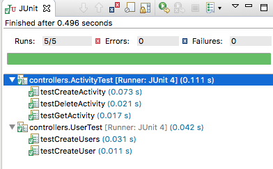

# Get and Delete Activity tests

Currently we might say that the `activities` endpoint is not quite testable yet - until we implement some way of removing activities. We will implement an API to remove all activities for a given user, and then write some tests to exercise this new feature.

First - start with the server:

# pacemaker-skeleton

We need to implement new api - delete all activities for a user. This requires 3 changes:

## PacemakerAPI

Method to remove all activities for a given user from our model:

~~~
  public void deleteActivities(String id) {
    Optional<User> user = Optional.fromNullable(userIndex.get(id));
    if (user.isPresent()) {
      user.get().activities.values().forEach(activity -> activitiesIndex.remove(activity.getId()));
      user.get().activities.clear();
    }
  }
~~~

## PacemakerRestService

Service implementation - which will be invoked by *Javalin* when this delete request is triggered:

~~~
  public void deleteActivities(Context ctx) {
    String id = ctx.param("id");
    pacemaker.deleteActivities(id);
    ctx.json(204);
  }
~~~

## RestMain

The registration of the new api path with Javalin:

~~~
    app.delete("/users/:id/activities", ctx -> {
      service.deleteActivities(ctx);
    });
~~~

# pacemaker-skeleton-client

##PacemakerAPI

Add the following route:

~~~
    @DELETE("/users/{id}/activities")
    Call<String> deleteActivities(@Path("id") String id);

~~~

and the asssociated method call:

~~~
    public void deleteActivities(String id) {
        try {
          Call<String> call = pacemakerInterface.deleteActivities(id);
          call.execute();
        } catch (Exception e) {
          System.out.println(e.getMessage());
        }
      }
~~~

##ActivityTest.java

We can now write some new tests:

~~~
  @Test
  public void testGetActivity() {
    Activity activity = new Activity("run", "fridge", 0.5);
    Activity returnedActivity1 = pacemaker.createActivity(homer.id, activity.type, activity.location, activity.distance);
    Activity returnedActivity2 = pacemaker.getActivity(homer.id, returnedActivity1.id);
    assertEquals(returnedActivity1, returnedActivity2);
  }
  
  @Test
  public void testDeleteActivity() {
    Activity activity = new Activity("sprint", "pub", 4.5);
    Activity returnedActivity = pacemaker.createActivity(homer.id, activity.type, activity.location, activity.distance);
    assertNotNull (returnedActivity);
    pacemaker.deleteActivities(homer.id);
    returnedActivity = pacemaker.getActivity(homer.id, returnedActivity.id);
    assertNull (returnedActivity);
  }
~~~

Read these tests carefully - and verify that they all pass.

If you find your testGetActivity fails, it could be that you don't have the route in your RestMain configRoutes.  Try adding this:

~~~
    app.get("/users/:id/activities/:activityId", ctx -> {
      service.getActivity(ctx);
    });
~~~
