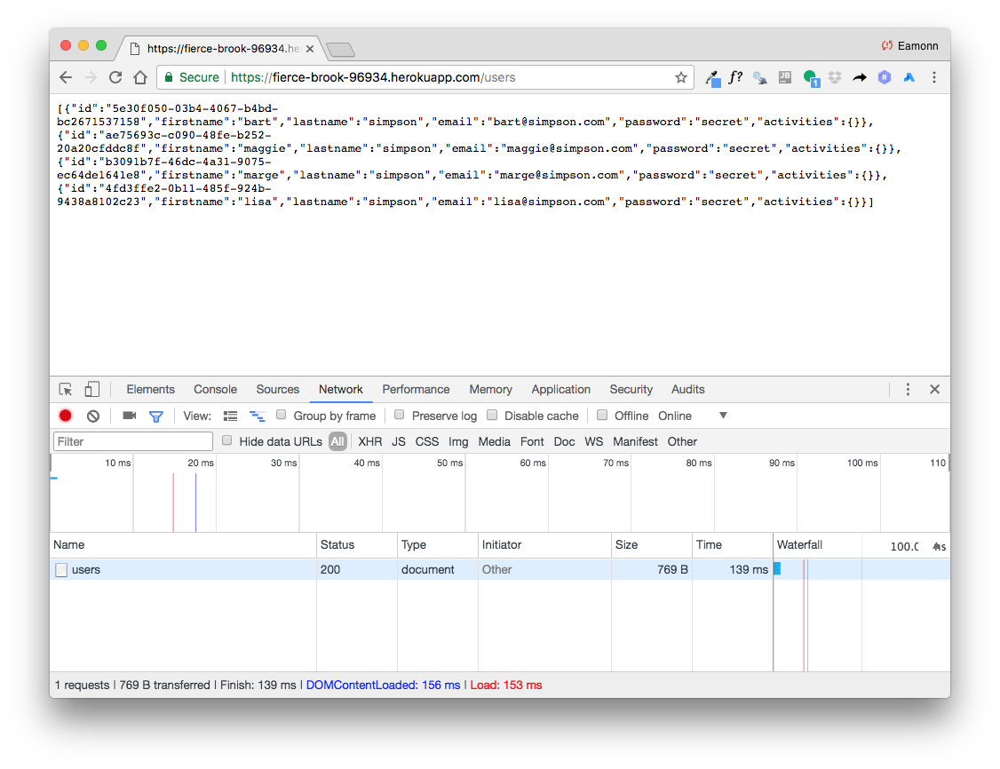
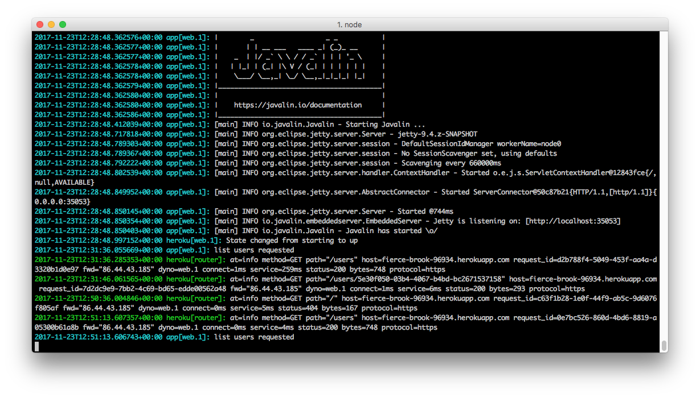

## Heroku

We will use the Heroku provider. Create a free account on the service now:

- <https://www.heroku.com/>

You will also need to download and install the Heroku CLI:

- <https://devcenter.heroku.com/articles/heroku-cli>

Once installed, open a command prompt/shell `inside the pacemaker-skeleton folder`, and log in to heroku:

~~~
heroku login
Email: youremail@domain.com
Password: **********
Logged in as youremail@domain.com
~~~

Once logged in - you have a range of commands available:

- <https://devcenter.heroku.com/articles/heroku-cli-commands>

We will be interested in these commands:

- create
- apps
- logs

Lets try to create an app:

~~~
heroku create
Creating app... done, ⬢ fierce-brook-96934
https://fierce-brook-96934.herokuapp.com/ | https://git.heroku.com/fierce-brook-96934.git
~~~

Heroku generates the url when you create the app. If you forget it, you can list all apps:

~~~
 heroku apps
~~~

The apps will also be listed on the web app (if you are logged in)

- <https://dashboard.heroku.com/apps>

# Deployment

Before we deploy the app - we need to place the application name (as generated above) into our POM

~~~
          <appName>fierce-brook-96934</appName>
~~~

(This was YOUR-APP-NAME previously).

From within the application folder, enter this command to deploy:

~~~
mvn heroku:deploy
~~~

This will take a few minutes - and should conclude with something like this:

~~~
[INFO] -----> Packaging application...
[INFO]        - app: fierce-brook-96934
[INFO]        - including: target/
[INFO] -----> Creating build...
[INFO]        - file: target/heroku/slug.tgz
[INFO]        - size: 12MB
[INFO] -----> Uploading build...
[INFO]        - success
[INFO] -----> Deploying...
[INFO] remote:
[INFO] remote: -----> heroku-maven-plugin app detected
[INFO] remote: -----> Installing OpenJDK 1.8... done
[INFO] remote: -----> Discovering process types
[INFO] remote:        Procfile declares types -> web
[INFO] remote:
[INFO] remote: -----> Compressing...
[INFO] remote:        Done: 61.1M
[INFO] remote: -----> Launching...
[INFO] remote:        Released v7
[INFO] remote:        https://fierce-brook-96934.herokuapp.com/ deployed to Heroku
[INFO] remote:
[INFO] -----> Done
[INFO] ------------------------------------------------------------------------
[INFO] BUILD SUCCESS
[INFO] ------------------------------------------------------------------------
[INFO] Total time: 54.253 s
[INFO] Finished at: 2017-11-23T12:28:47Z
[INFO] Final Memory: 36M/622M
[INFO] ------------------------------------------------------------------------
~~~

If all goes well, the application should be deployed on the generated url. The application does not have a UX, so you will need to test it via the api:

If you wish to see the application console - for debugging or other purposes - you can run this command :

~~~
heroku logs --tail
~~~

This will reveal the console, more or less as you would have seen it in Eclipse when running locally:

