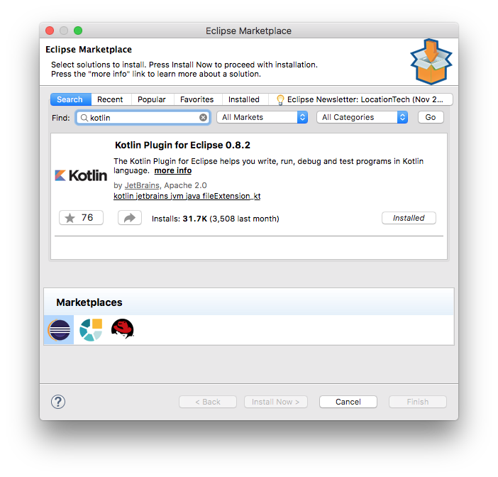
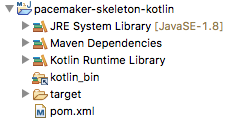
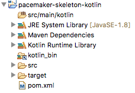

# Kotlin

In eclipse, visit the Eclipse Marketplace (Help->Eclipse Marketplace), locate and install the Kotlin plugin:

You may need to restart eclipse.

Outside of Eclipse, create a new folder called `pacemaker-skeleton-kotlin`, and create this new `pom.xml` file:

~~~
<project xmlns="http://maven.apache.org/POM/4.0.0" xmlns:xsi="http://www.w3.org/2001/XMLSchema-instance"
  xsi:schemaLocation="http://maven.apache.org/POM/4.0.0 http://maven.apache.org/xsd/maven-4.0.0.xsd">
  <modelVersion>4.0.0</modelVersion>

  <groupId>pacemaker</groupId>
  <artifactId>pacemaker-skeleton-kotlin</artifactId>
  <version>1.0</version>
  <packaging>jar</packaging>

  <name>pacemaker-skeleton</name>
  <url>http://maven.apache.org</url>

  <properties>
    <project.build.sourceEncoding>UTF-8</project.build.sourceEncoding>
    <maven.compiler.source>1.8</maven.compiler.source>
    <maven.compiler.target>1.8</maven.compiler.target>
    <kotlin.version>1.1.60</kotlin.version>
  </properties>

  <build>
    <sourceDirectory>src/main/kotlin</sourceDirectory>
    <testSourceDirectory>src/test/kotlin</testSourceDirectory>

    <plugins>
      <plugin>
        <groupId>org.apache.maven.plugins</groupId>
        <artifactId>maven-compiler-plugin</artifactId>
        <version>3.7.0</version>
        <configuration>
          <source>1.8</source>
          <target>1.8</target>
        </configuration>
      </plugin>
      
      <plugin>
        <groupId>org.jetbrains.kotlin</groupId>
        <artifactId>kotlin-maven-plugin</artifactId>
        <version>${kotlin.version}</version>
        <executions>
          <execution>
            <id>compile</id>
            <phase>compile</phase>
            <goals>
              <goal>compile</goal>
            </goals>
          </execution>
          <execution>
            <id>test-compile</id>
            <phase>test-compile</phase>
            <goals>
              <goal>test-compile</goal>
            </goals>
          </execution>
        </executions>
      </plugin>      
      
      <plugin>
        <artifactId>maven-assembly-plugin</artifactId>
        <executions>
          <execution>
            <phase>package</phase>
            <goals>
              <goal>single</goal>
            </goals>
          </execution>
        </executions>
        <configuration>
          <descriptorRefs>
            <descriptorRef>jar-with-dependencies</descriptorRef>
          </descriptorRefs>
          <archive>
            <manifest>
              <mainClass>controllers.RestMainKt</mainClass>
            </manifest>
          </archive>
        </configuration>
      </plugin>

      <plugin>
        <groupId>com.heroku.sdk</groupId>
        <artifactId>heroku-maven-plugin</artifactId>
        <version>1.1.3</version>
        <configuration>
          <jdkVersion>1.8</jdkVersion>
          <appName>YOUR APP NAME</appName>
          <processTypes>
            <web>java -jar ./target/pacemaker-skeleton-kotlin-1.0-jar-with-dependencies.jar</web>
          </processTypes>
        </configuration>
      </plugin>      
    </plugins>
  </build>

  <dependencies>
    <dependency>
      <groupId>junit</groupId>
      <artifactId>junit</artifactId>
      <version>4.12</version>
      <scope>test</scope>
    </dependency>
    <dependency>
      <groupId>com.google.guava</groupId>
      <artifactId>guava</artifactId>
      <version>23.0</version>
    </dependency>
    <dependency>
      <groupId>asg-cliche</groupId>
      <artifactId>asg-cliche</artifactId>
      <version>1.0</version>
    </dependency>
    <dependency>
      <groupId>java-ascii-table</groupId>
      <artifactId>java-ascii-table</artifactId>
      <version>1.0</version>
    </dependency>
    <dependency>
      <groupId>io.javalin</groupId>
      <artifactId>javalin</artifactId>
      <version>0.5.1</version>
    </dependency>
    <dependency>
      <groupId>org.slf4j</groupId>
      <artifactId>slf4j-simple</artifactId>
      <version>1.7.21</version>
    </dependency>
    <dependency>
      <groupId>com.fasterxml.jackson.core</groupId>
      <artifactId>jackson-databind</artifactId>
      <version>2.9.1</version>
    </dependency>
  </dependencies>
</project>
~~~

In Eclipse, import the folder as a Maven project.

Notice the project does not have a source folder yet. Create this folder structure now (on the command line or using Explorer/Finder)

~~~
└── src
     ├── main
           └──kotlin
~~~

Back in Eclipse, refresh the project - and the (empty) source folder should appear:

