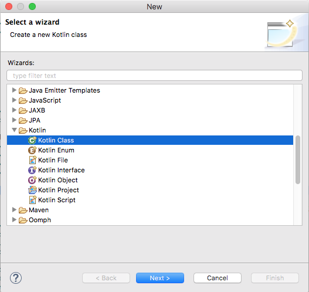
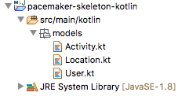

# Models

Note: when coding in Kotlin, you might find it easier to switch to the **Kotlin** perspective in Eclipse (see the buttons on the top right hand corner of Eclipse). 

Create a new package in the src/main/kotlin folder called `models`, and create three new Kotlin classes:

- Location
- Activity
- User

These are the sources for these classes:

## Location

~~~
package models

data class Location(
    val latitude: Double,
    val longitude: Double)
~~~

## Activity

~~~
package models

import java.util.UUID

data class Activity(
    var type: String = "",
    var location: String = "",
    var distance: Float = 0.0f,
    var id: String = UUID.randomUUID().toString(),
    val route: MutableList<Location> = ArrayList())
~~~

## User

~~~
package models

import java.util.UUID

data class User(
    val firstname: String = "",
    val lastname: String = "",
    val email: String = "",
    val password: String = "",
    var id: String = UUID.randomUUID().toString(),
    val activities: MutableMap<String, Activity> = hashMapOf<String, Activity>())
~~~

These are [Kotlin Data Classes](https://kotlinlang.org/docs/reference/data-classes.html) - they are functionally equivalent to the Java equivalents from pacemaker-skeleton, with much of the extra methods auto-generated. 