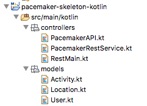
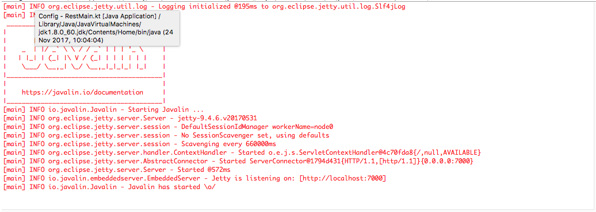
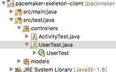
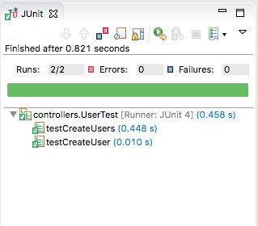

# controllers User Endpoints

Create three Kotlin classes in a new controllers package:

- PacemakerAPI
- PacemakerRestService
- RestMain

These are the sources:

## PacemakerAPI

~~~
package controllers

import java.util.UUID;
import models.Activity
import models.Location
import models.User

class PacemakerAPI {

  var userIndex = hashMapOf<String, User>()
  var emailIndex = hashMapOf<String, User>()
  var activitiesIndex = hashMapOf<String, Activity>()
  var users = userIndex.values
    
  fun createUser(firstName: String, lastName: String, email: String, password: String): User {
    var user = User(firstName, lastName, email, password)
    userIndex[user.id] = user
    emailIndex[user.email] = user
    return user
  }
  
  fun deleteUsers() {
    userIndex.clear();
    emailIndex.clear()
  }

  fun getUser(id: String) = userIndex[id]
  fun getUserByEmail(email: String) = emailIndex[email]
}
~~~

## PacemakerRestService

~~~
package controllers

import io.javalin.Context
import models.Activity
import models.Location
import models.User

class PacemakerRestService  {
  val pacemaker = PacemakerAPI()

  fun listUsers(ctx: Context) {
    ctx.json(pacemaker.users)
  }
  
  fun createUser(ctx: Context) {
    val user = ctx.bodyAsClass(User::class.java)
    val newUser = pacemaker.createUser(user.firstname, user.lastname, user.email, user.password)
    ctx.json(newUser)
  }

  fun deleteUsers(ctx: Context) {
    pacemaker.deleteUsers()
    ctx.status(200)
  }
}
~~~

## RestMain

~~~
package controllers

import io.javalin.Javalin

fun main(args: Array<String>) {
  val app = Javalin.create().port(getHerokuAssignedPort()).start()
  val service = PacemakerRestService()
  configRoutes(app, service)
}

private fun getHerokuAssignedPort(): Int {
  val processBuilder = ProcessBuilder()
  return if (processBuilder.environment()["PORT"] != null) {
    Integer.parseInt(processBuilder.environment()["PORT"])
  } else 7000
}

fun configRoutes(app: Javalin, service: PacemakerRestService) {
  app.get("/users") { ctx -> service.listUsers(ctx) }
  app.post("/users") { ctx -> service.createUser(ctx) }
  app.delete("/users") { ctx -> service.deleteUsers(ctx) }
}
~~~

You should be able to run the application now:

This is supporting the users endpoint - making the service available on <http://localhost:7000>

We already have a set of tests built to exercises these routes - in `UsersTest` in pacemaker-skeleton-client.

Run these test now - they should pass:

The service is implemented in Kotlin - the tests are in Java.

