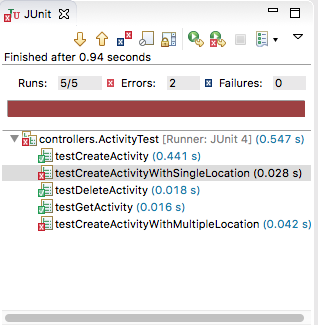

# controllers Activity Endpoints

Initial activity endpoints can now be implemented:

## PacemakerAPI

~~~
  fun createActivity(id: String, type: String, location: String, distance: Float): Activity? {
    var activity:Activity? = null
    var user = userIndex.get(id)
    if (user != null) {
      activity = Activity(type, location, distance)
      user.activities[activity.id] = activity
      activitiesIndex[activity.id] = activity;
    }
    return activity;
  }
  
  fun getActivity(id: String): Activity? {
    return activitiesIndex[id]
  }

  fun deleteActivities(id: String) {
    require(userIndex[id] != null)
    var user = userIndex.get(id)
    if (user != null) {
      for ((u, activity) in user.activities) {
        activitiesIndex.remove(activity.id)
      }
      user.activities.clear();
    }
  }
~~~

## PacemakerRestService

~~~
  fun getActivity(ctx: Context) {
    // val userId: String? = ctx.param("id")
    val activityId: String? = ctx.param("activityId") 
    val activity = pacemaker.getActivity(activityId!!)
    if (activity != null) {
      ctx.json(activity)
    } else {
      ctx.status(404)
    }
  }

  fun getActivities(ctx: Context) {
    val id: String? =  ctx.param("id")
    val user = pacemaker.getUser(id!!)
    if (user != null) {
      ctx.json(user.activities)
    } else {
      ctx.status(404)
    }
  }

   fun createActivity(ctx: Context) {
    val id: String? =  ctx.param("id")
    val user = pacemaker.getUser(id!!)
    if (user != null) {
      val activity = ctx.bodyAsClass(Activity::class.java)
      val newActivity = pacemaker.createActivity(user.id, activity.type, activity.location, activity.distance)
      ctx.json(newActivity!!)
    } else {
      ctx.status(404)
    }
  }
  
  fun deleteActivites(ctx: Context) {
    val id: String? =  ctx.param("id")
    pacemaker.deleteActivities(id!!);
    ctx.status(204)
  }
~~~

## RestMain

~~~
  app.get("/users/:id/activities") { ctx -> service.getActivities(ctx) }
  app.get("/users/:id/activities/:activityId") { ctx -> service.getActivity(ctx) }
  app.post("/users/:id/activities") { ctx -> service.createActivity(ctx) }
  app.delete("/users/:id/activities") { ctx -> service.deleteActivites(ctx) }
~~~  

We can now try the ActivityTest from pacemaker-skeleton-client:

Notice that the location endpoints are failing - as we have not yet implemented them.

Note: if more of your tests have errors in them when compared with the above graphic, you might need to stop the Kotlin Rest service and restart it (to pick up the above changes).
  

